# Azure Load Balancer and Application Gateway

## Overview
Azure provides two main load balancing services: Azure Load Balancer for network layer (Layer 4) load balancing and Application Gateway for application layer (Layer 7) load balancing and web application firewall capabilities.

## Azure Load Balancer

### Core Components

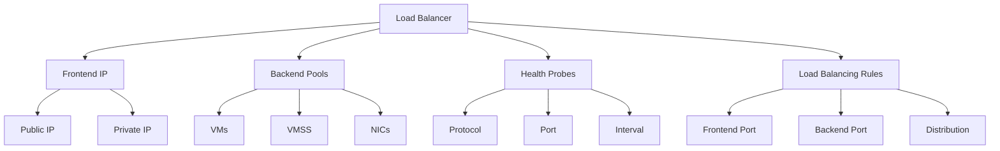

### Types and SKUs

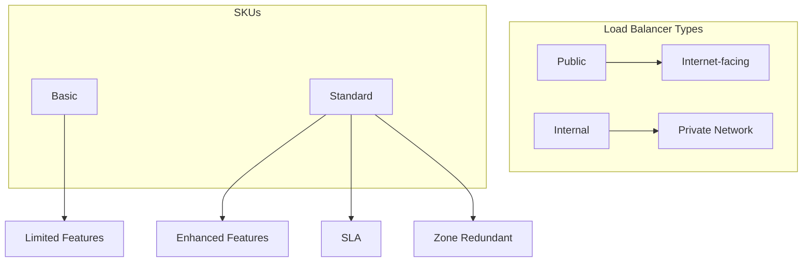

## Application Gateway

### Architecture Components

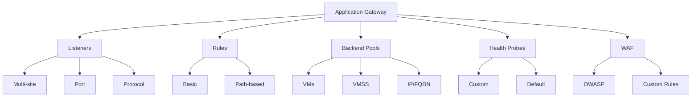

### Routing Capabilities

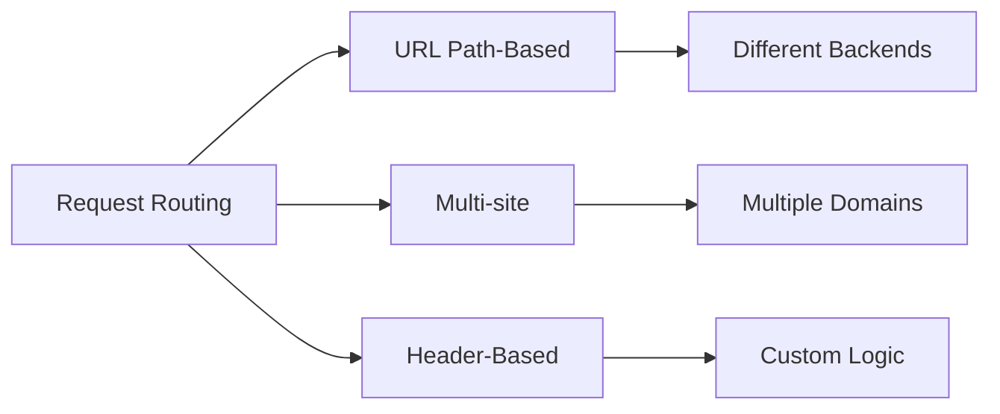

## Implementation Examples

### 1. Basic Load Balancer Setup
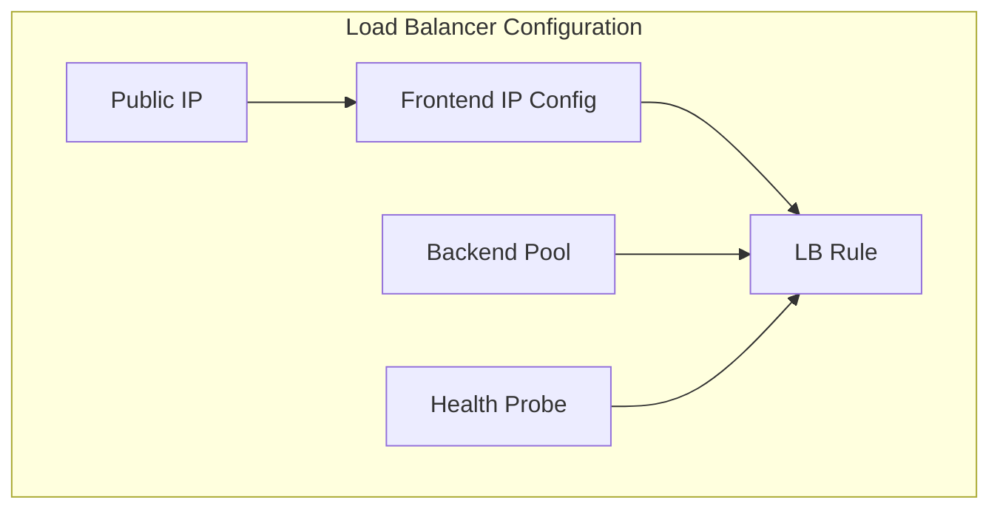

### 2. Application Gateway with WAF
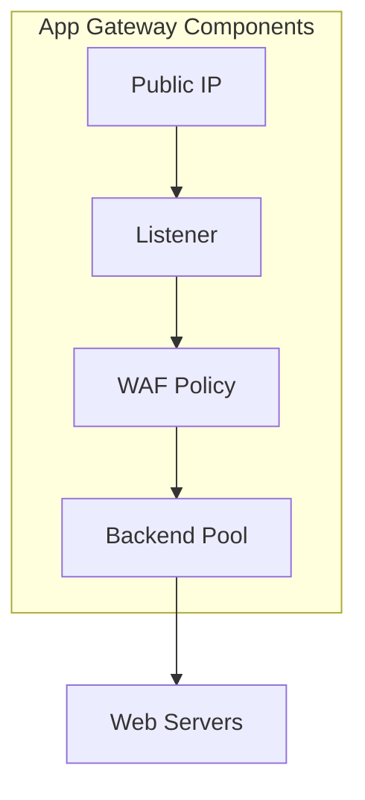

## Security Implementation

### 1. Network Security
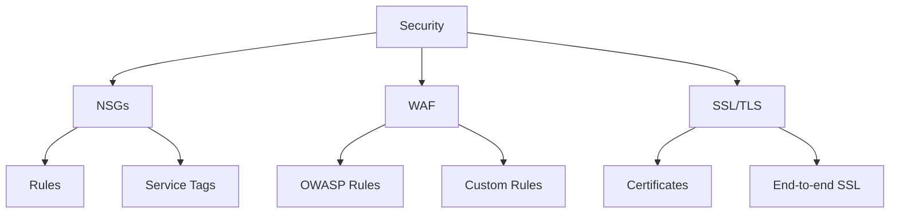

### 2. Access Control
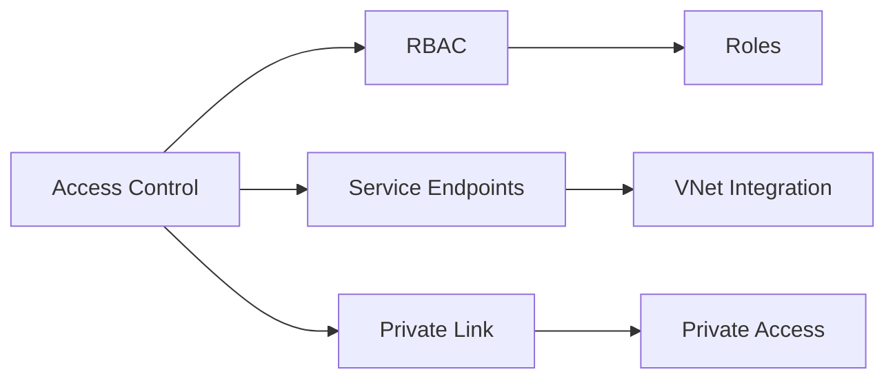

## Monitoring and Diagnostics

### 1. Load Balancer Monitoring
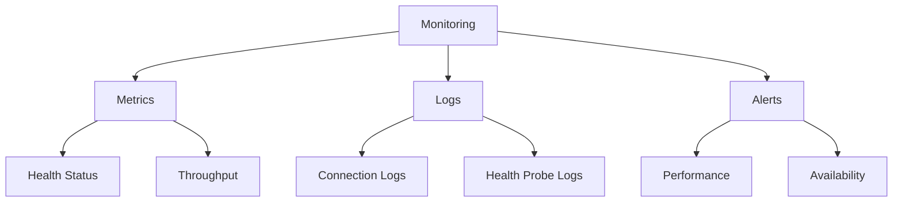

### 2. Application Gateway Insights
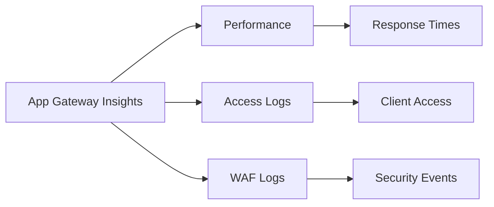

## Best Practices

### 1. High Availability
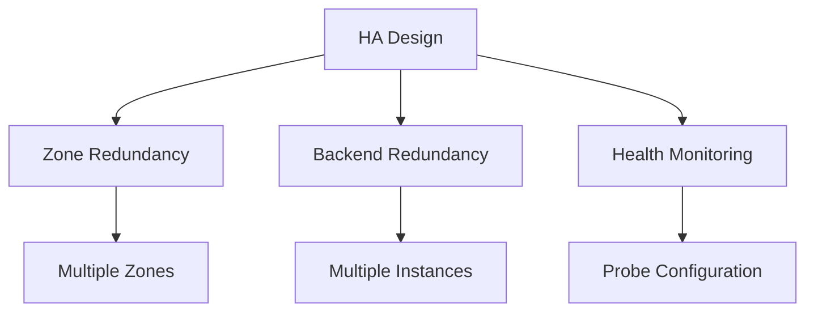

### 2. Performance Optimization
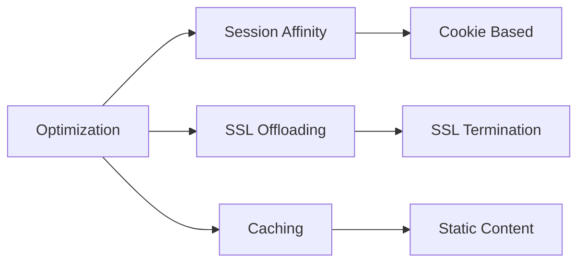

## Cost Management

### 1. Load Balancer Costs
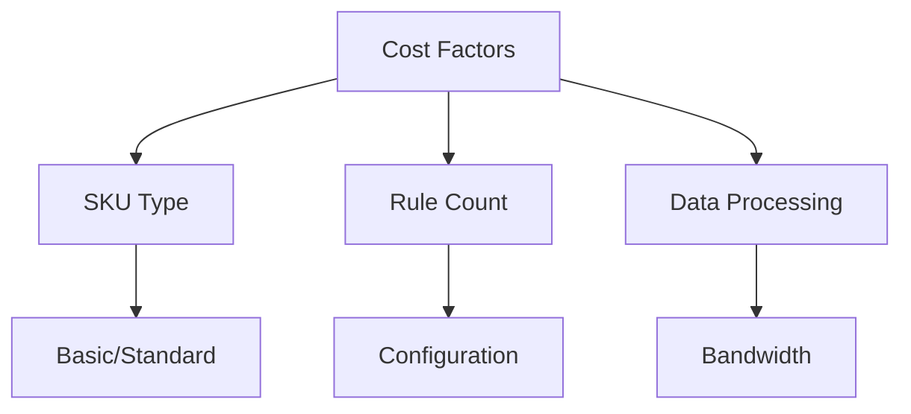

### 2. Application Gateway Costs
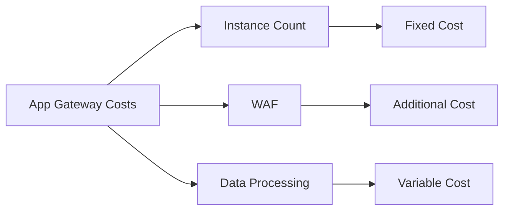

## Troubleshooting Guide

### 1. Common Issues
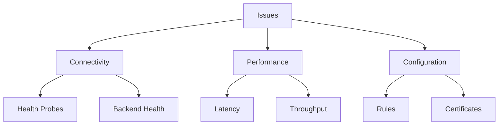

### 2. Diagnostic Tools
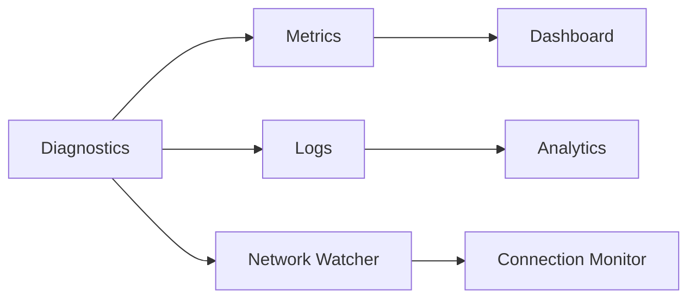

## Integration Features

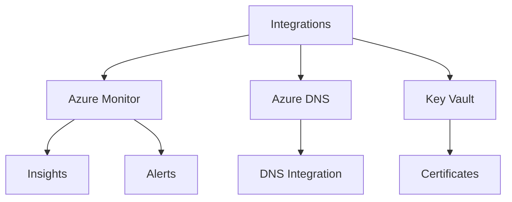

## Best Practices Summary

1. **Load Balancer**
   - Use Standard SKU for production
   - Configure proper health probes
   - Implement zone redundancy
   - Monitor backend health

2. **Application Gateway**
   - Enable WAF for web applications
   - Configure SSL properly
   - Implement proper routing rules
   - Monitor performance metrics

3. **Security**
   - Implement proper NSG rules
   - Use WAF policies
   - Regular security monitoring
   - Certificate management

## Further Reading
- [Azure Load Balancer Documentation](https://learn.microsoft.com/en-us/azure/load-balancer/)
- [Application Gateway Documentation](https://learn.microsoft.com/en-us/azure/application-gateway/)
- [Load Balancing Best Practices](https://learn.microsoft.com/en-us/azure/architecture/guide/technology-choices/load-balancing-overview)