# Azure Load Balancer and Traffic Manager

## Overview
Azure provides multiple services for load balancing and traffic routing: Azure Load Balancer for network/application load balancing, and Traffic Manager for DNS-based global traffic routing.

## Azure Load Balancer

### Core Components

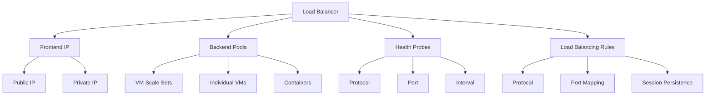

### Types of Load Balancers

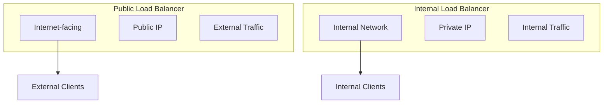

## Traffic Manager

### Architecture Components

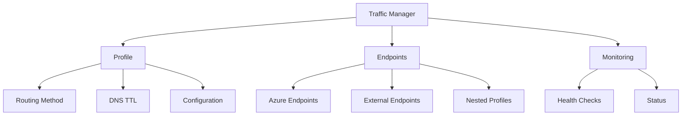

### Routing Methods

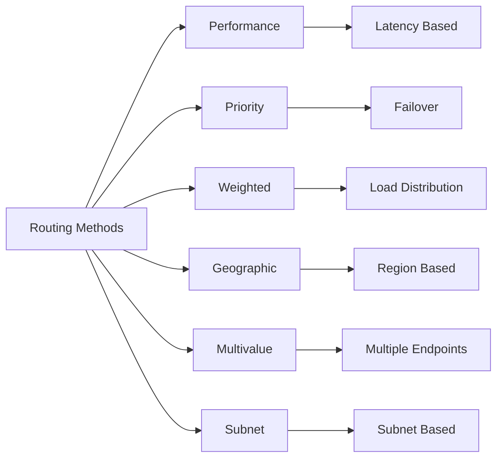

## Implementation Examples

### 1. Load Balancer Setup
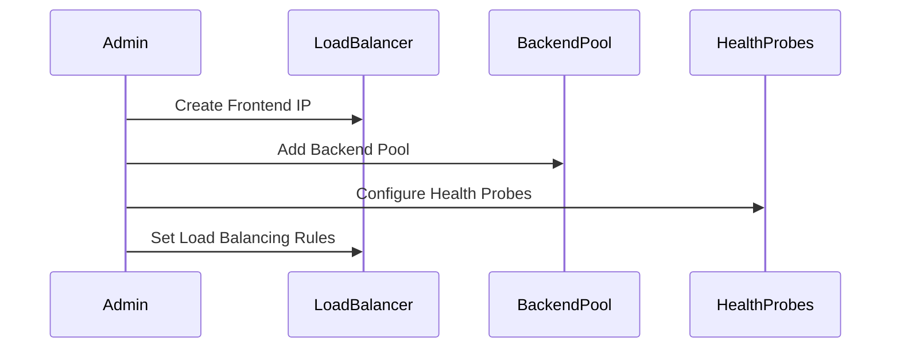

### 2. Traffic Manager Configuration
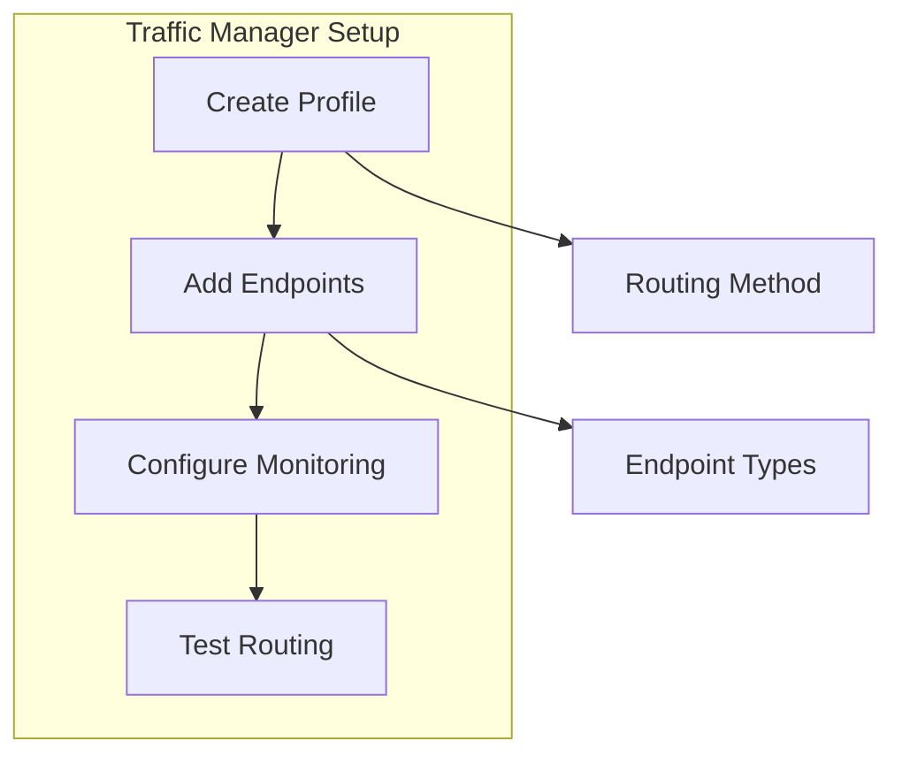

## Load Balancing Patterns

### 1. Layer 4 Load Balancing
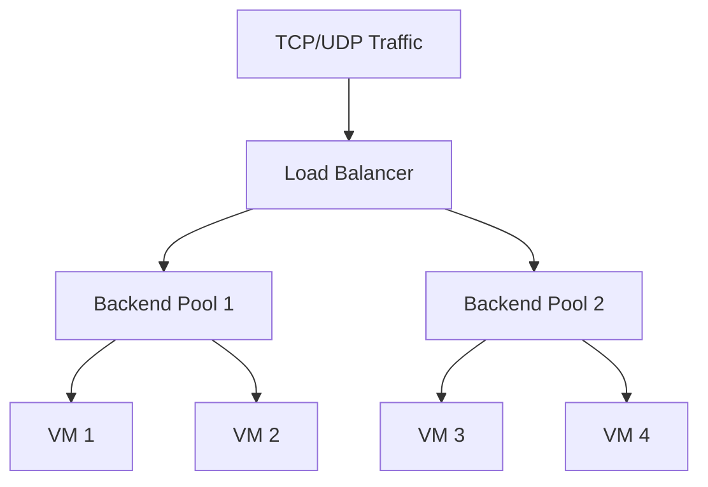

### 2. Global Load Balancing
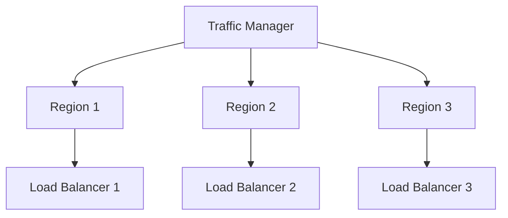

## Monitoring and Diagnostics

### 1. Health Monitoring
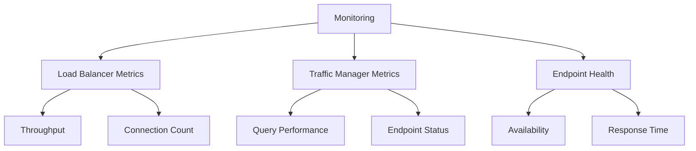

### 2. Diagnostics
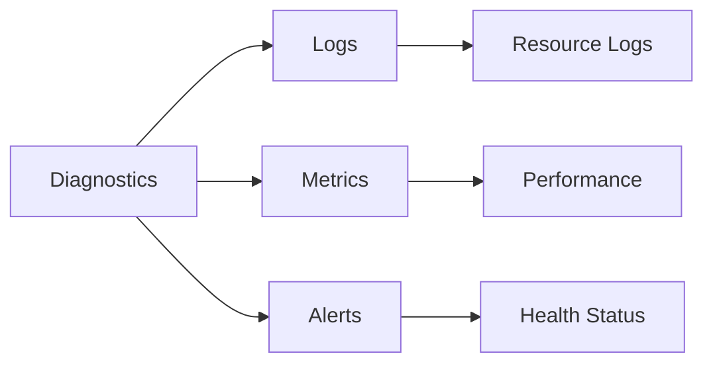

## Best Practices

### 1. Load Balancer Configuration
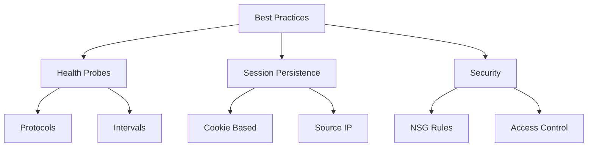

### 2. Traffic Manager Setup
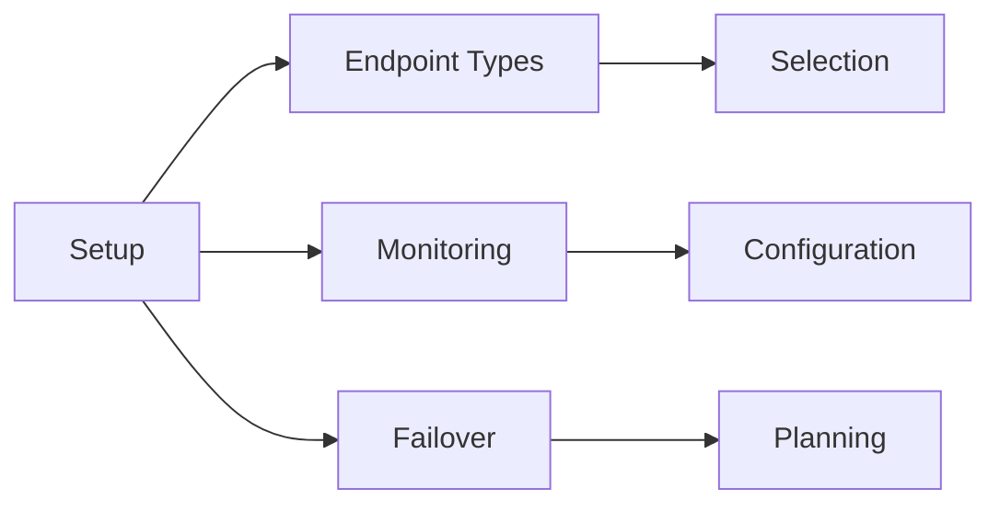

## High Availability Design

### 1. Regional Redundancy
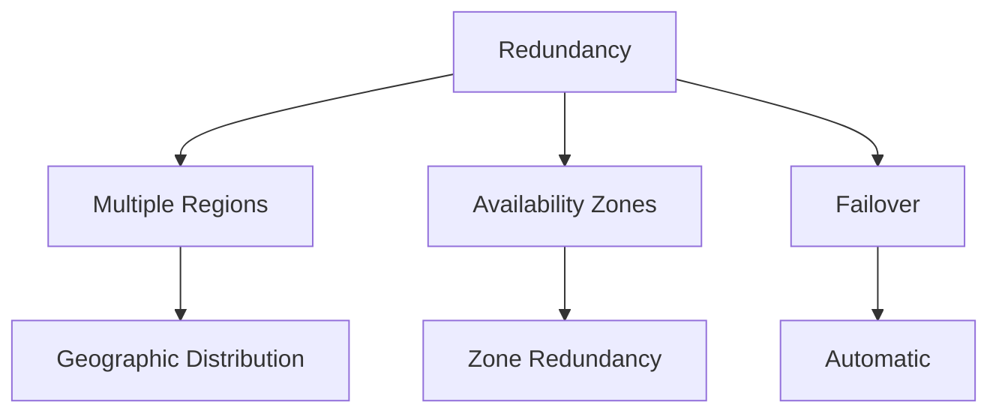

### 2. Health Checks
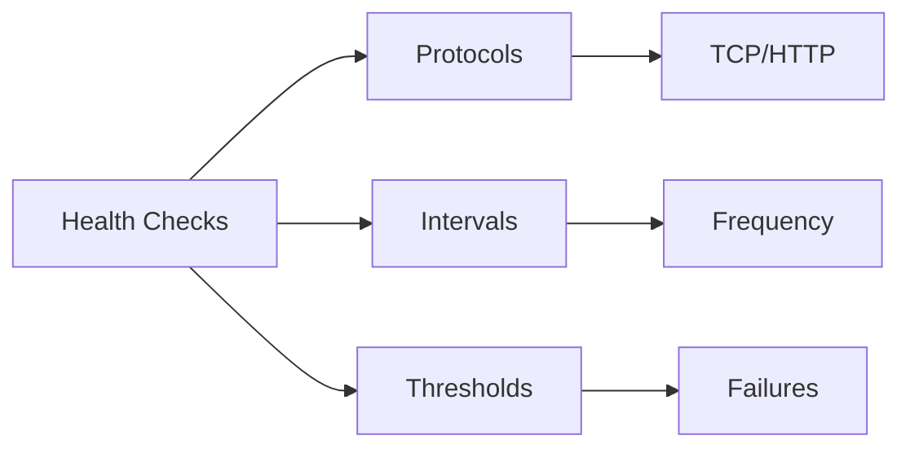

## Security Implementation

### 1. Network Security
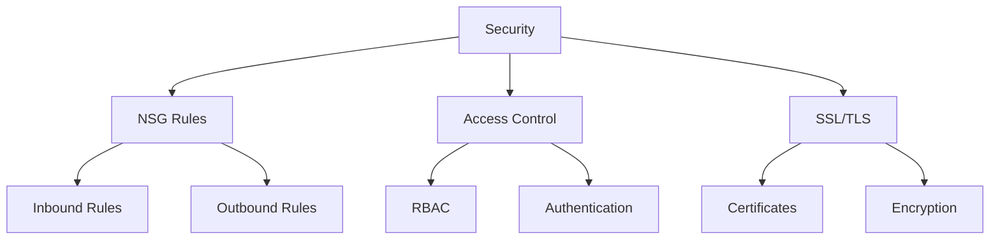

### 2. Access Management
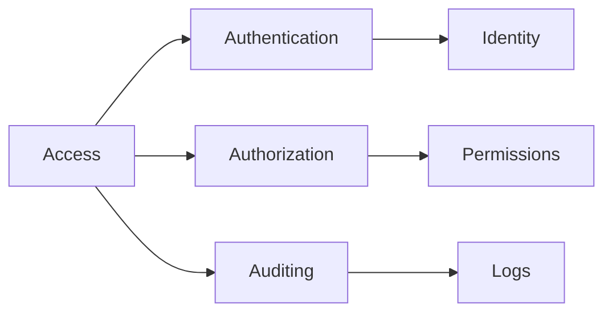

## Troubleshooting Guide

### 1. Common Issues
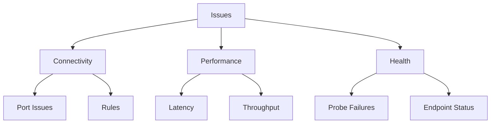

### 2. Resolution Steps
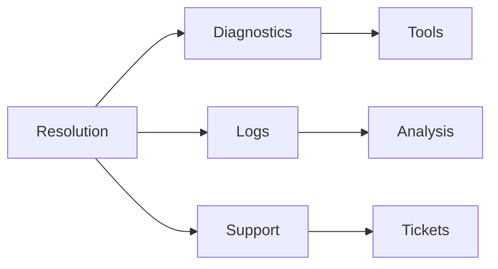

## Best Practices Summary

1. **Load Balancer Configuration**
   - Use appropriate health probes
   - Configure session persistence
   - Implement security rules
   - Monitor performance

2. **Traffic Manager Setup**
   - Choose correct routing method
   - Configure endpoints properly
   - Set up monitoring
   - Plan for failover

3. **Security Guidelines**
   - Implement NSG rules
   - Use RBAC
   - Enable logging
   - Regular security reviews

## Further Reading
- [Azure Load Balancer Documentation](https://learn.microsoft.com/en-us/azure/load-balancer/)
- [Traffic Manager Documentation](https://learn.microsoft.com/en-us/azure/traffic-manager/)
- [Load Balancing Best Practices](https://learn.microsoft.com/en-us/azure/load-balancer/load-balancer-best-practices)