# Azure Local Network Gateway

Azure Local Network Gateway represents your on-premises network when configuring a Site-to-Site VPN connection or a VNet-to-VNet connection. It defines the address space, public IP address, and BGP settings of your on-premises location for Azure to route traffic appropriately.

## Core Components

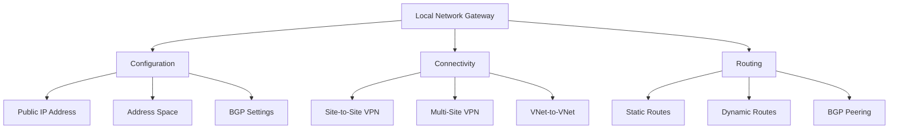

## Implementation Architecture

### 1. Site-to-Site Configuration
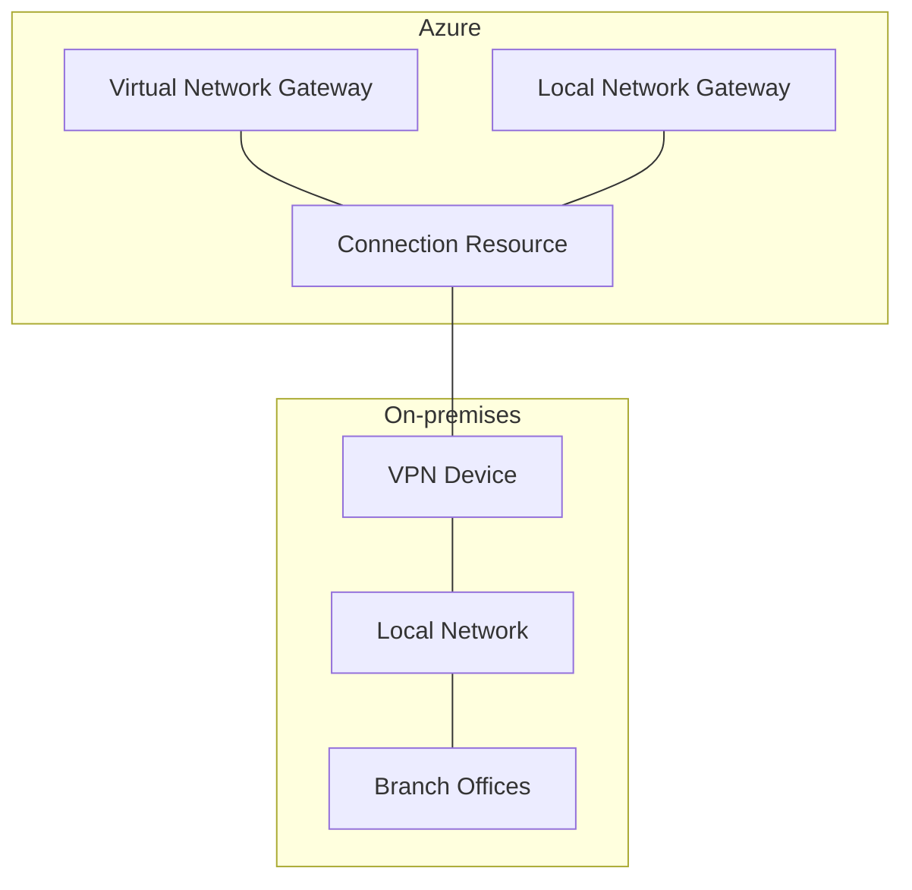

### 2. Multi-Site Setup
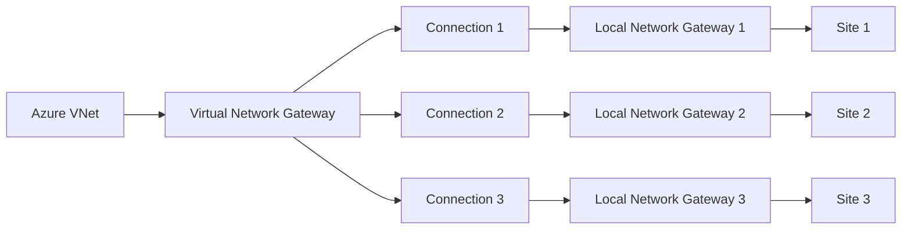

## BGP Configuration

### 1. BGP Settings
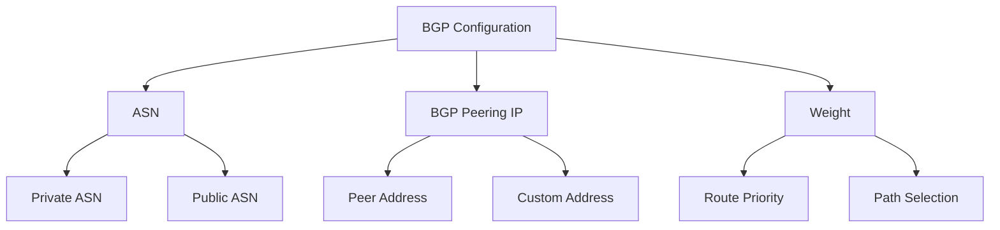

### 2. Route Advertisement
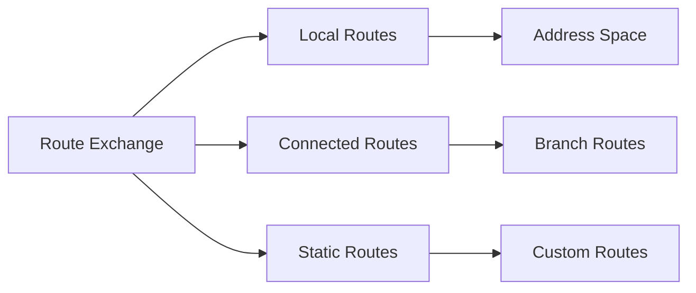

## High Availability Design

### 1. Redundant Connectivity
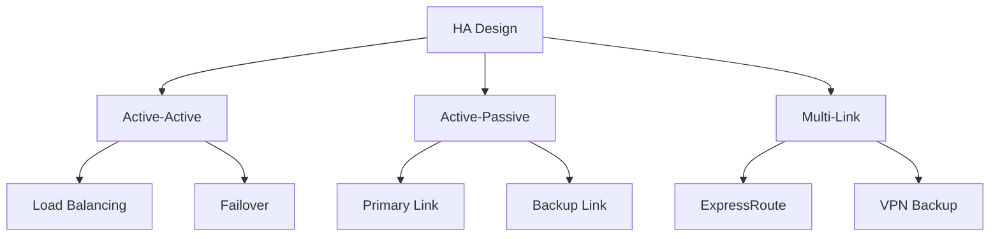

### 2. Failover Configuration
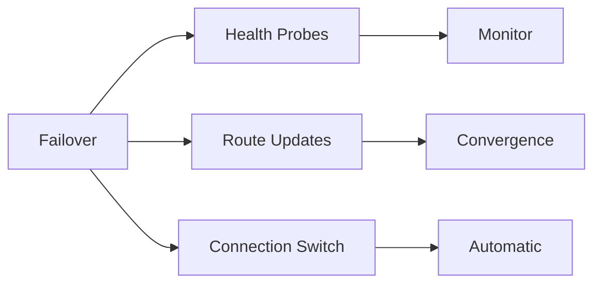

## Security Features

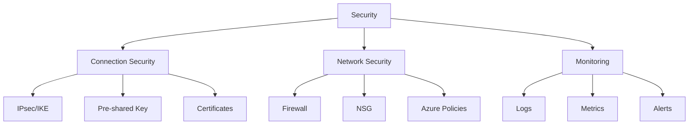

## Implementation Examples

### 1. Basic Configuration
```yaml
localNetworkGateway:
  name: "onprem-gateway"
  resourceGroup: "network-rg"
  location: "eastus"
  gatewayIpAddress: "203.0.113.1"
  addressPrefixes:
    - "10.1.0.0/16"
    - "172.16.0.0/12"
  bgpSettings:
    asn: 65515
    bgpPeeringAddress: "10.1.0.1"
    peerWeight: 0
```

### 2. Multi-Site Configuration
```yaml
connections:
  - name: "site1-connection"
    type: "IPsec"
    sharedKey: "<key>"
    enableBgp: true
    localNetworkGateway: "site1-gateway"
    
  - name: "site2-connection"
    type: "IPsec"
    sharedKey: "<key>"
    enableBgp: true
    localNetworkGateway: "site2-gateway"
```

## Monitoring and Management

### 1. Connection Monitoring
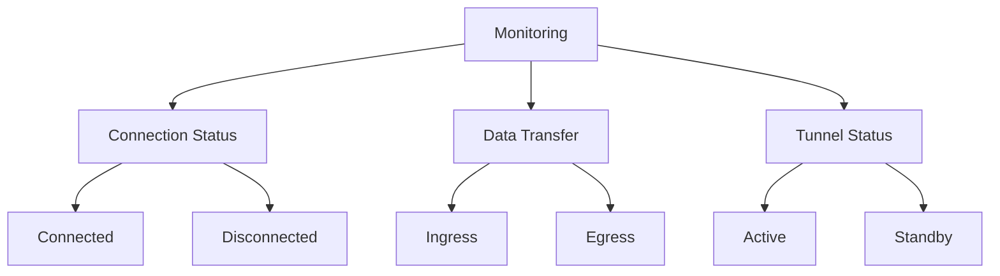

### 2. Diagnostic Settings
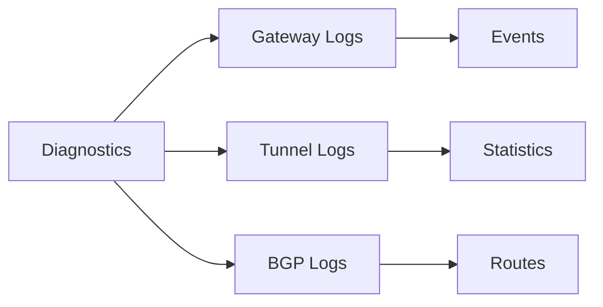

## Best Practices

1. **Design Considerations**
   - Plan address spaces carefully
   - Configure BGP when possible
   - Implement redundancy
   - Monitor connection health

2. **Security Guidelines**
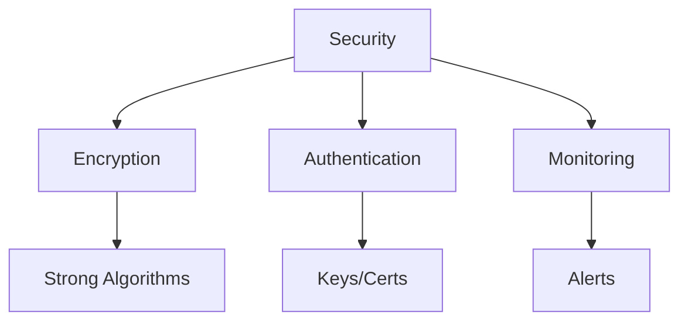

## Troubleshooting Guide

1. **Common Issues**
   - Connection drops
   - BGP peering problems
   - Route propagation delays
   - IPsec misconfigurations

2. **Resolution Steps**
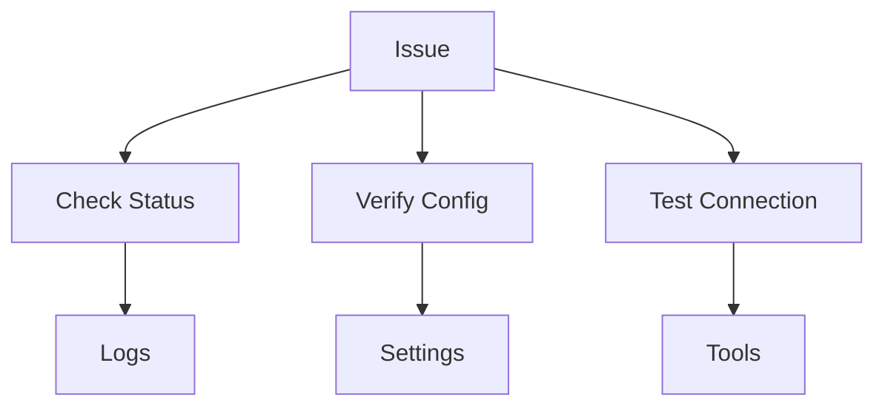

## Further Reading
- [Local Network Gateway Documentation](https://learn.microsoft.com/en-us/azure/vpn-gateway/vpn-gateway-about-vpn-gateway-settings)
- [BGP with VPN Gateway](https://learn.microsoft.com/en-us/azure/vpn-gateway/vpn-gateway-bgp-overview)
- [VPN Troubleshooting](https://learn.microsoft.com/en-us/azure/vpn-gateway/vpn-gateway-troubleshoot)
- [High Availability Design](https://learn.microsoft.com/en-us/azure/vpn-gateway/vpn-gateway-highlyavailable)