# Azure Network Watcher

Azure Network Watcher provides network monitoring and diagnostics tools to observe, diagnose, and gain insights into your network performance and health in Azure. It offers a comprehensive suite of tools for deep network visibility and troubleshooting capabilities.

## Core Features

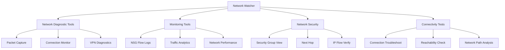

## Diagnostic Tools in Detail

### 1. Connection Monitor
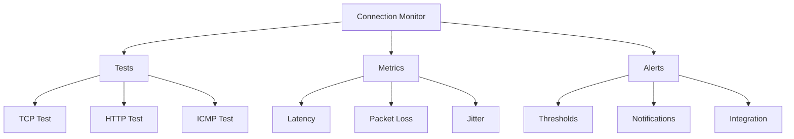

### 2. Packet Capture
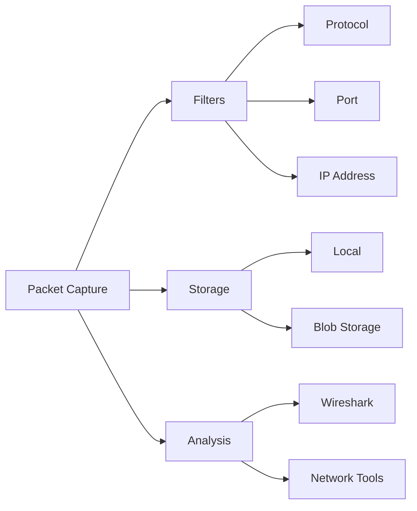

## Network Security Analysis

### 1. NSG Flow Logs
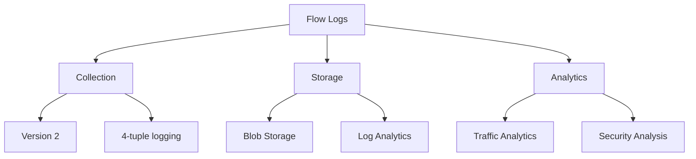

### 2. Security Group View
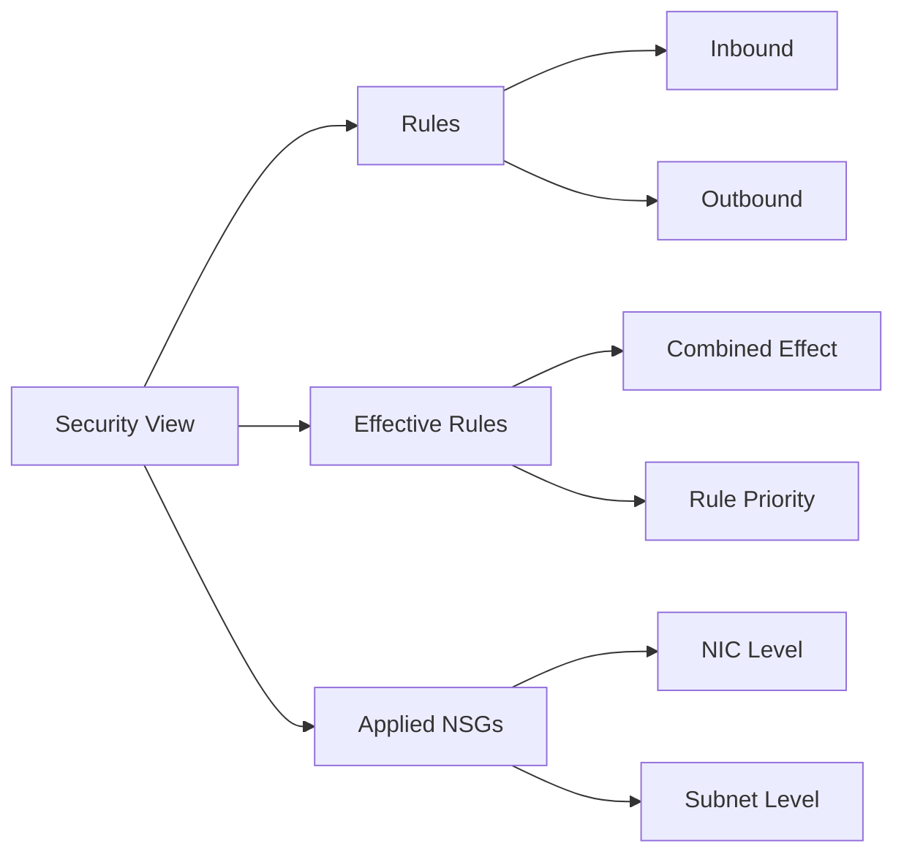

## Performance Monitoring

### 1. Network Performance Monitor
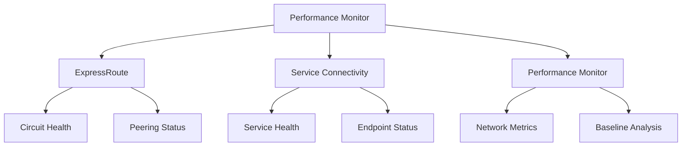

### 2. Traffic Analytics
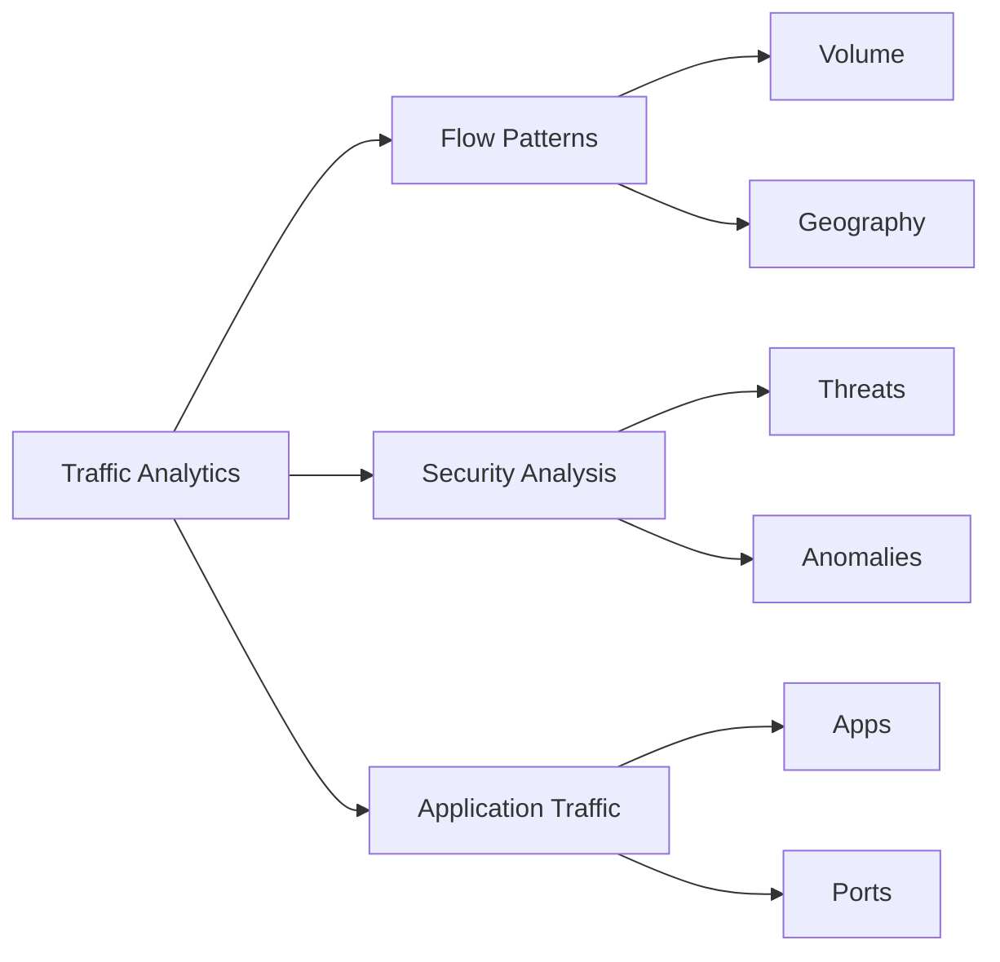

## Troubleshooting Features

### 1. Network Troubleshooting
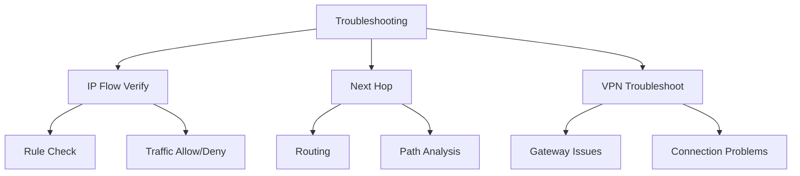

### 2. Connectivity Check
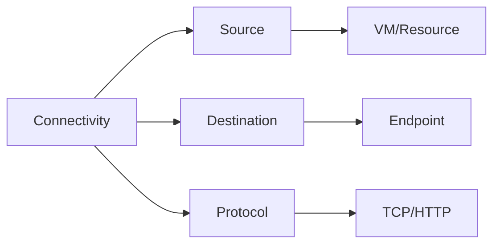

## Integration with Azure Services

### 1. Monitoring Integration
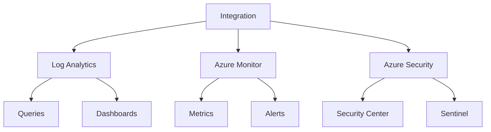

### 2. Storage and Analysis
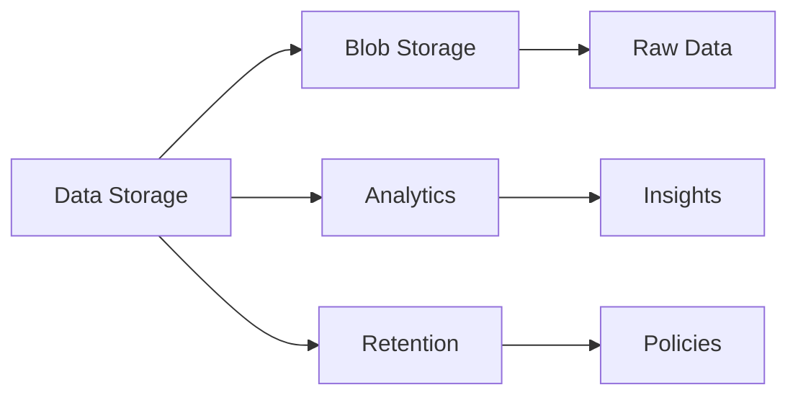

## Best Practices

1. **Implementation Strategy**
   - Enable NSG flow logs in all regions
   - Configure appropriate retention periods
   - Set up regular connectivity monitoring
   - Implement automated alerts

2. **Resource Monitoring**
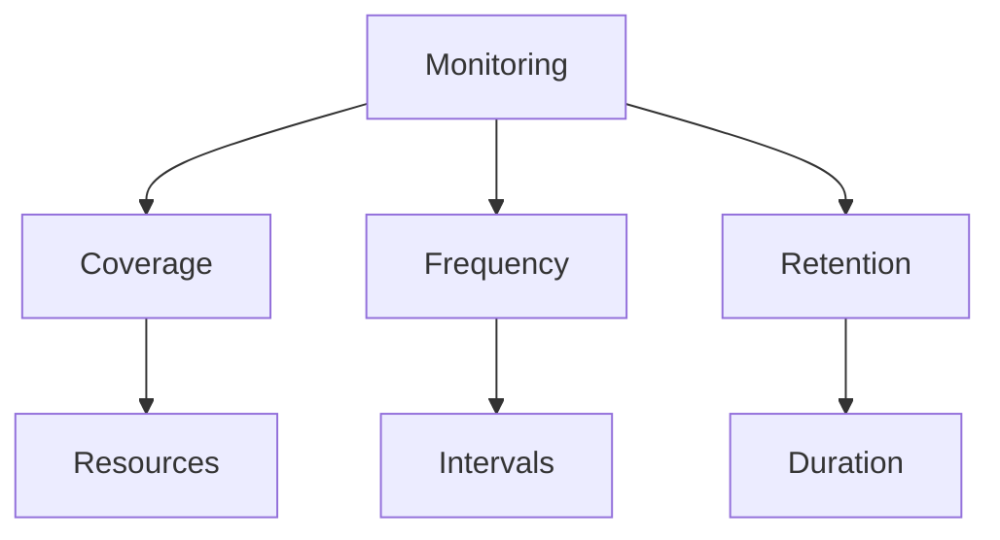

3. **Cost Optimization**
   - Use targeted packet capture
   - Configure appropriate log retention
   - Optimize storage usage
   - Monitor data transfer costs

## Troubleshooting Guide

1. **Common Scenarios**
   - Connectivity issues
   - Performance problems
   - Security rule verification
   - VPN connection issues

2. **Resolution Steps**
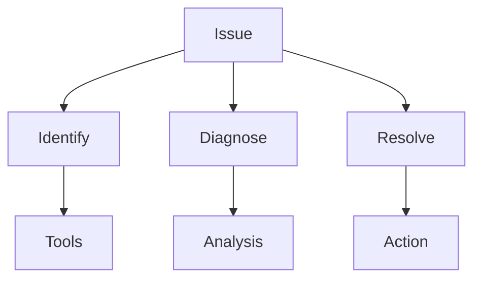

## Further Reading
- [Network Watcher Documentation](https://learn.microsoft.com/en-us/azure/network-watcher/)
- [NSG Flow Logs Guide](https://learn.microsoft.com/en-us/azure/network-watcher/network-watcher-nsg-flow-logging-overview)
- [Connection Monitor](https://learn.microsoft.com/en-us/azure/network-watcher/connection-monitor-overview)
- [Traffic Analytics](https://learn.microsoft.com/en-us/azure/network-watcher/traffic-analytics)