# Azure Policy and Role-Based Access Control (RBAC)

## Overview
Azure Policy and RBAC are fundamental components of Azure's governance and security framework. Azure Policy enforces organizational standards and compliance, while RBAC manages access rights to Azure resources.

## Azure Policy Components

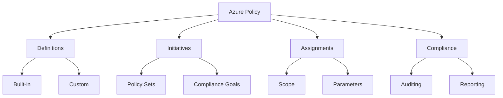

### Policy Definition Structure

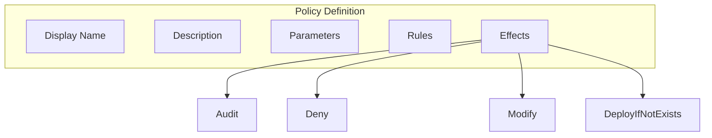

## RBAC Architecture

### 1. Core Components
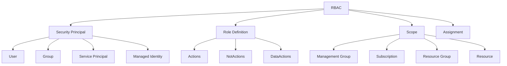

### 2. Role Types
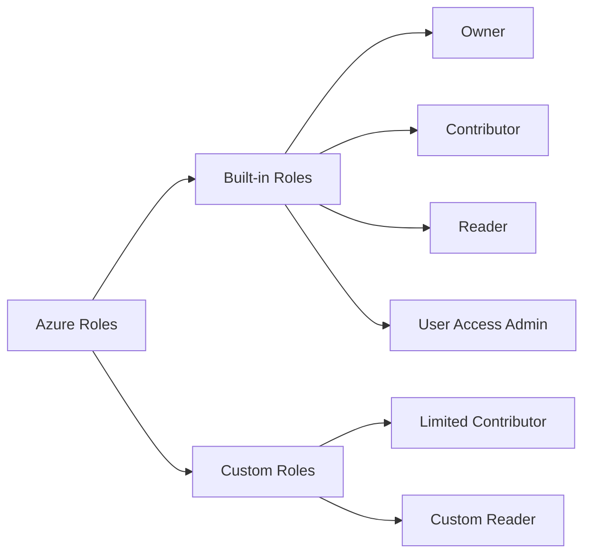

## Implementation Examples

### 1. Policy Implementation
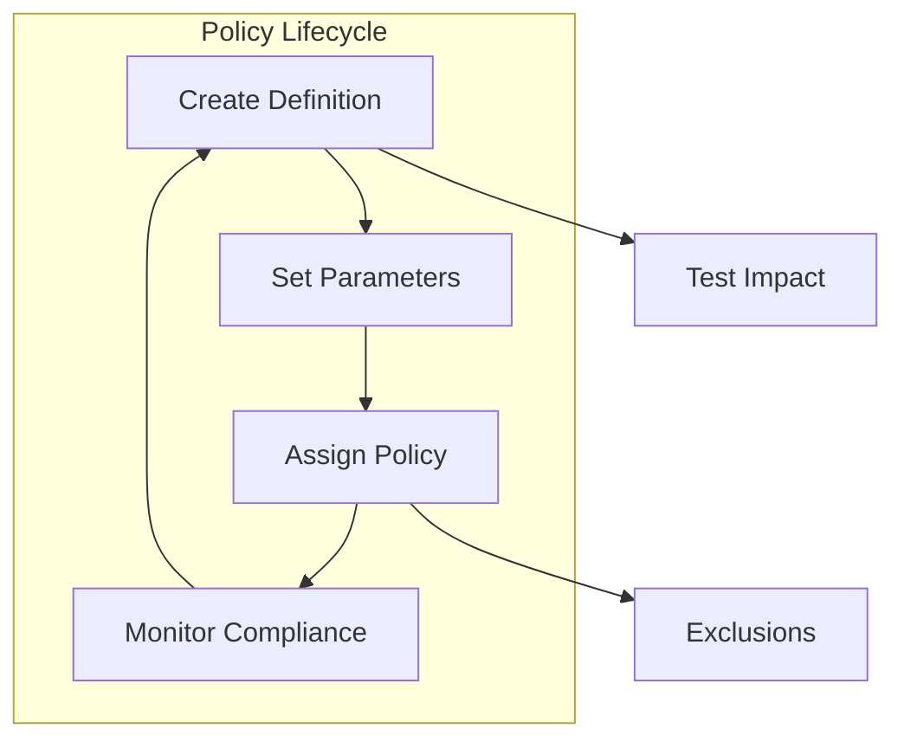

### 2. RBAC Implementation
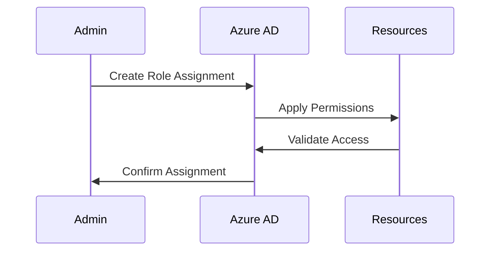

## Policy Effects and Actions

### 1. Policy Effects
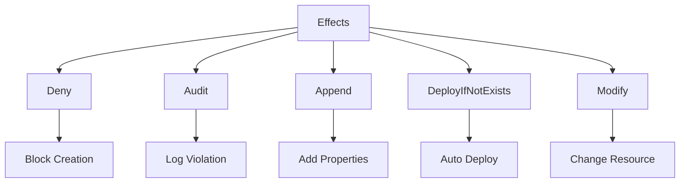

### 2. Common Actions
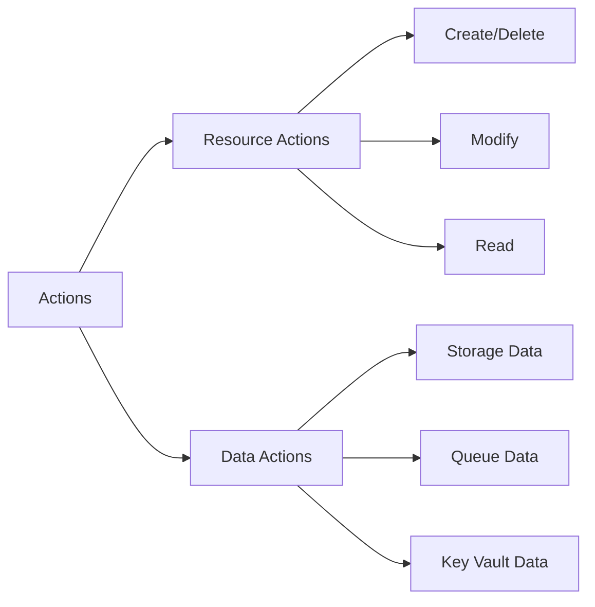

## Best Practices

### 1. Policy Management
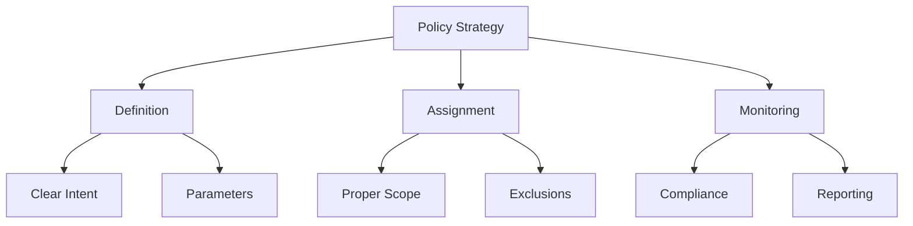

### 2. RBAC Design
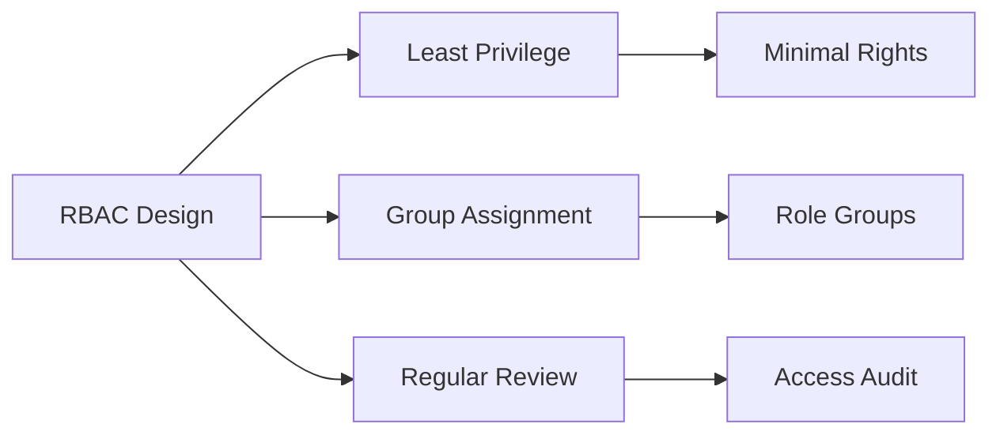

## Compliance Monitoring

### 1. Policy Compliance
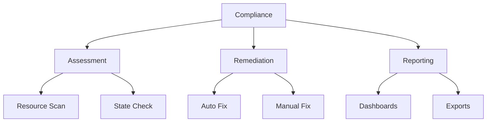

### 2. Access Review
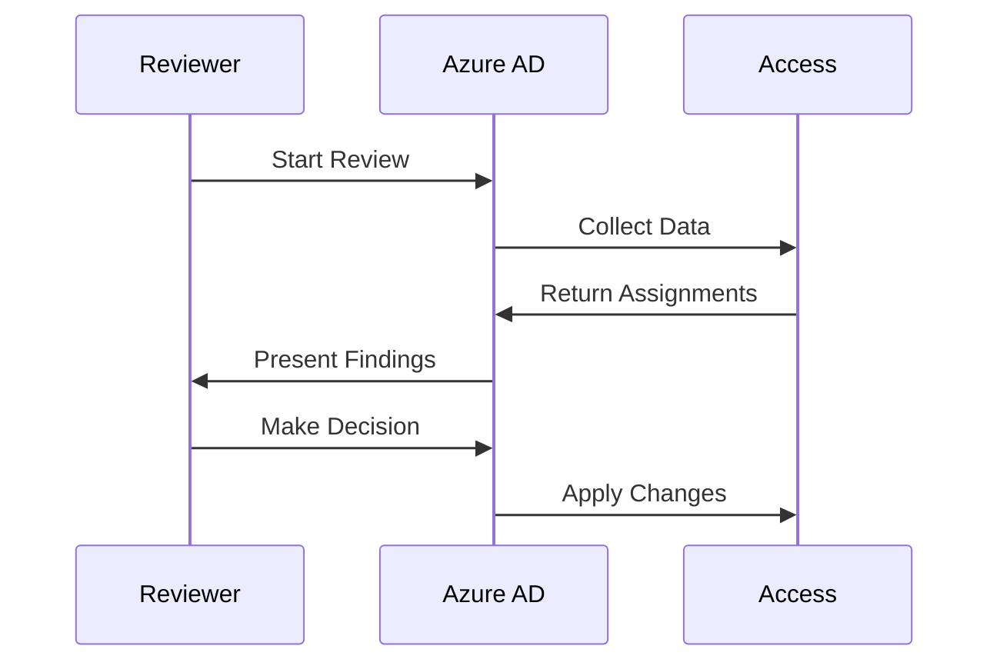

## Security and Governance

### 1. Security Implementation
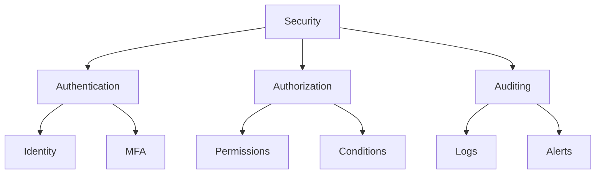

### 2. Governance Framework
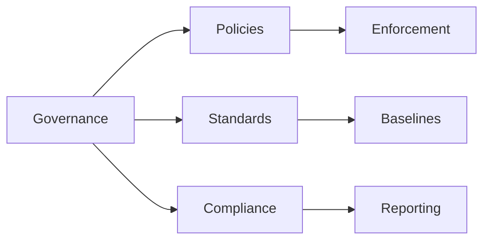

## Integration Features

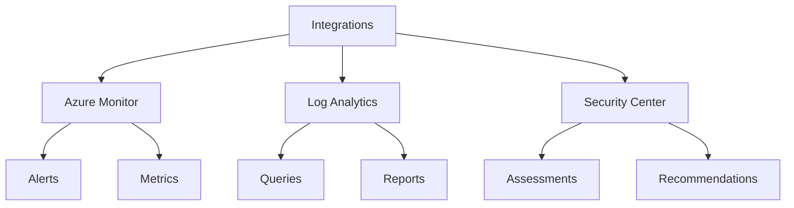

## Best Practices Summary

1. **Policy Implementation**
   - Start with audit effect
   - Test policies in limited scope
   - Use initiatives for related policies
   - Regular compliance monitoring

2. **RBAC Management**
   - Use built-in roles when possible
   - Implement least privilege
   - Regular access reviews
   - Document assignments

3. **Security Guidelines**
   - Enable Conditional Access
   - Implement PIM for privileged roles
   - Monitor and alert on changes
   - Regular security assessments

## Troubleshooting Guide

### 1. Policy Issues
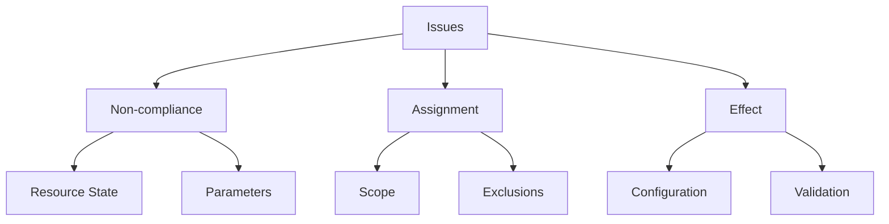

### 2. RBAC Problems
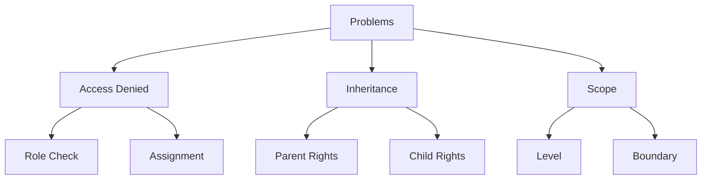

## Further Reading
- [Azure Policy Documentation](https://learn.microsoft.com/en-us/azure/governance/policy/)
- [RBAC Documentation](https://learn.microsoft.com/en-us/azure/role-based-access-control/)
- [Governance Best Practices](https://learn.microsoft.com/en-us/azure/cloud-adoption-framework/govern/)