# Azure Recovery Services Vault

Azure Recovery Services Vault is a storage entity that houses backup data and recovery points created over time. It serves as a central location for managing backups of Azure VMs, on-premises servers, and workloads, while also providing disaster recovery capabilities through Azure Site Recovery.

## Core Components

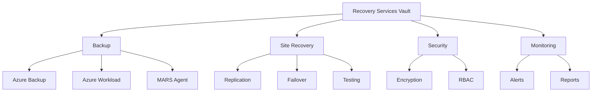

## Backup Features

### 1. Supported Workloads
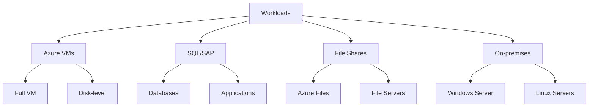

### 2. Backup Policies
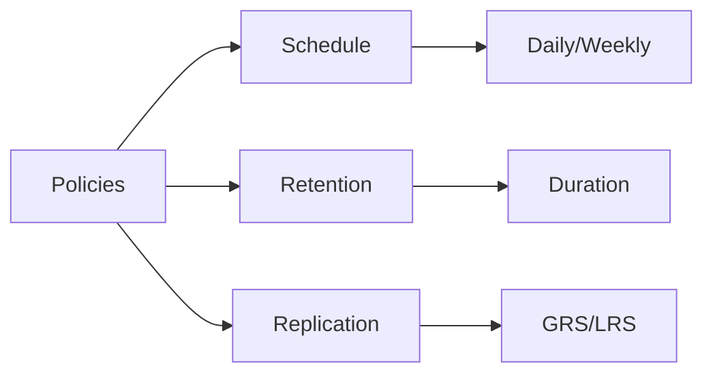

## Site Recovery Architecture

### 1. Replication Setup
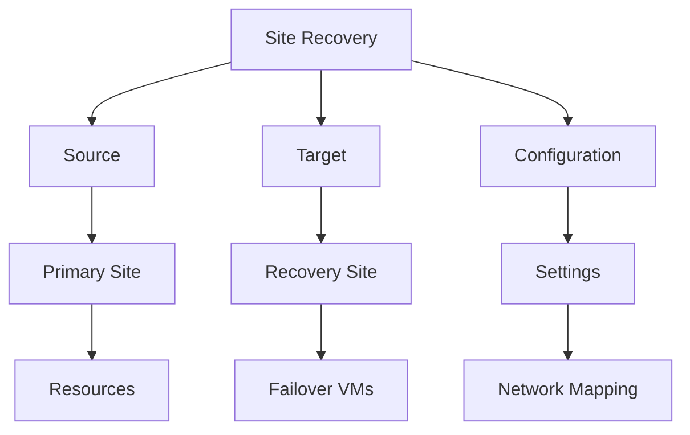

### 2. Failover Process
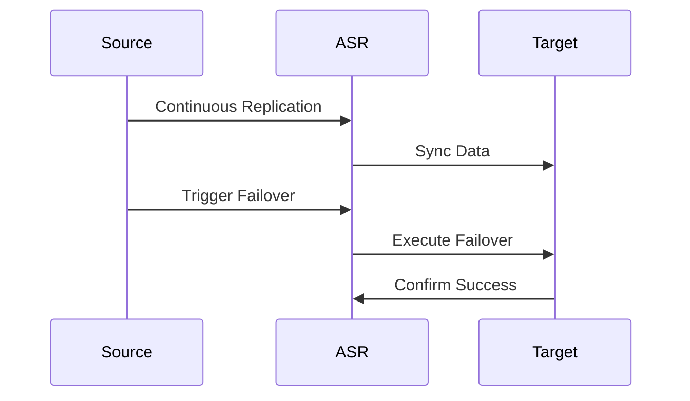

## Security and Compliance

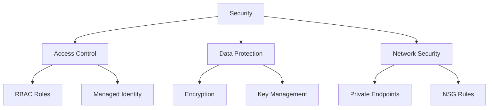

## Monitoring and Reporting

### 1. Backup Monitoring
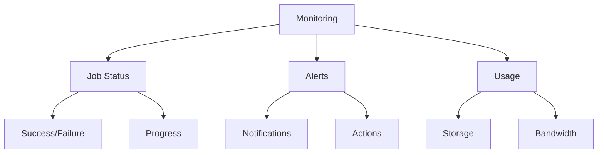

### 2. Recovery Monitoring
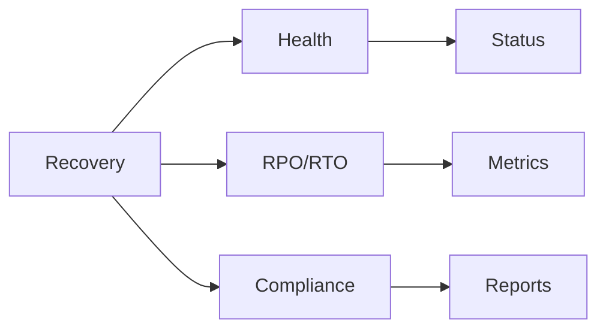

## Best Practices

1. **Vault Configuration**
   - Use separate vaults for different environments
   - Configure appropriate storage redundancy
   - Implement access controls
   - Regular monitoring and reporting

2. **Backup Strategy**
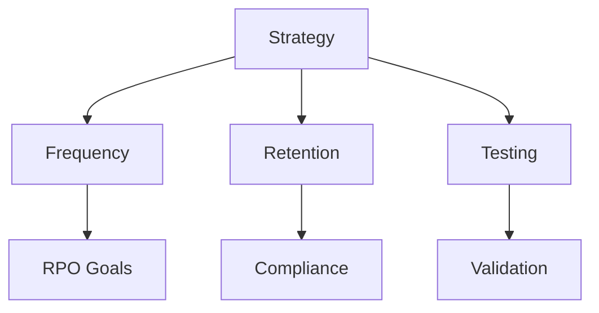

## Recovery Planning

### 1. DR Strategy
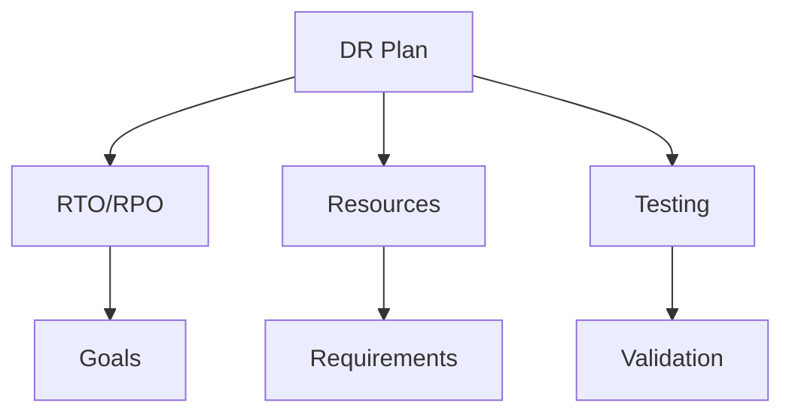

### 2. Failover Configuration
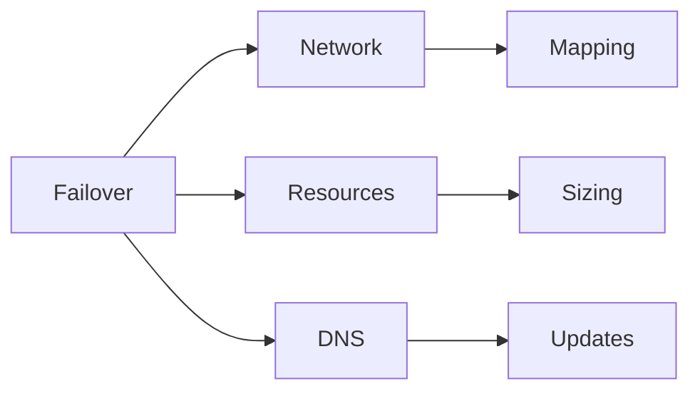

## Cost Management

### 1. Cost Components
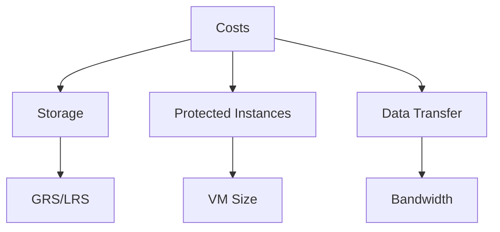

### 2. Optimization Strategies
- Right-size retention periods
- Use appropriate storage tier
- Optimize backup frequency
- Monitor usage patterns

## Troubleshooting Guide

1. **Common Issues**
   - Backup failures
   - Replication errors
   - Connectivity problems
   - Performance issues

2. **Resolution Steps**
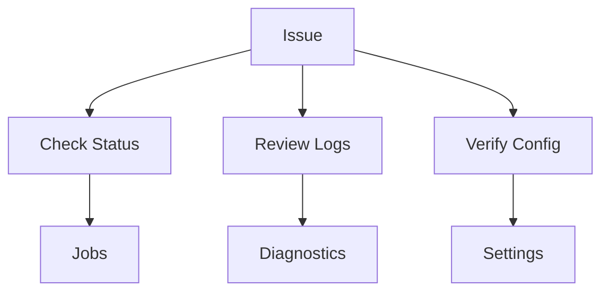

## Further Reading
- [Recovery Services Documentation](https://learn.microsoft.com/en-us/azure/backup/)
- [Site Recovery Guide](https://learn.microsoft.com/en-us/azure/site-recovery/)
- [Backup Best Practices](https://learn.microsoft.com/en-us/azure/backup/backup-best-practices)