# Azure Resource Manager (ARM)

Azure Resource Manager is the deployment and management service for Azure. It provides a management layer that enables you to create, update, and delete resources in your Azure account. ARM offers features like access control, locks, tags, and templates for consistent and repeatable deployments, making it the foundation for building and managing your Azure infrastructure at scale.

# Azure Resource Manager (ARM) and Resource Groups

## Overview
Azure Resource Manager is the deployment and management service for Azure. It provides a management layer that enables you to create, update, and delete resources in your Azure account.

## Core Components

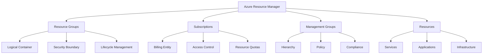

## Resource Organization

### 1. Management Hierarchy
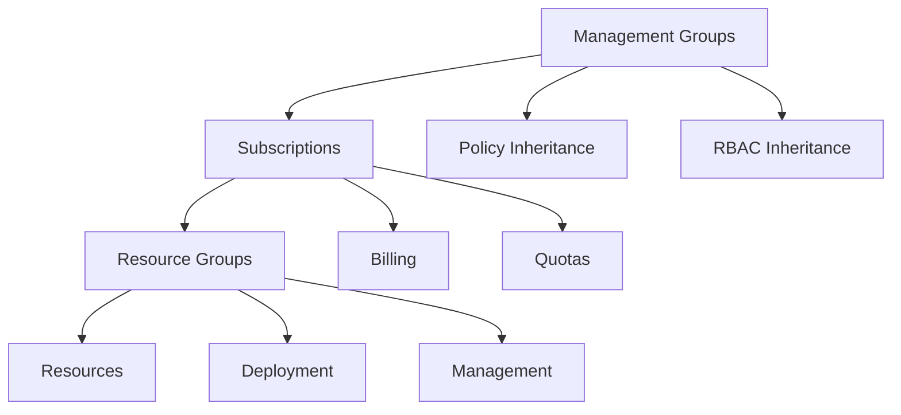

### 2. Resource Grouping Strategies
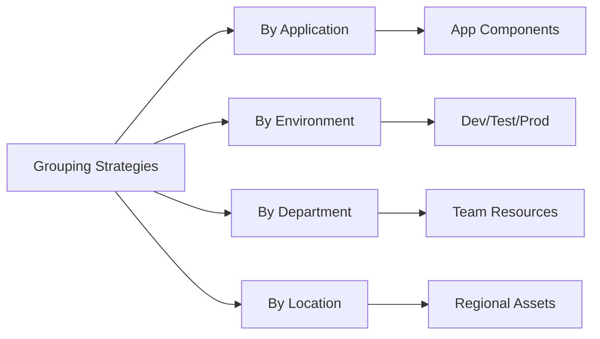

## Infrastructure as Code

### 1. ARM Templates
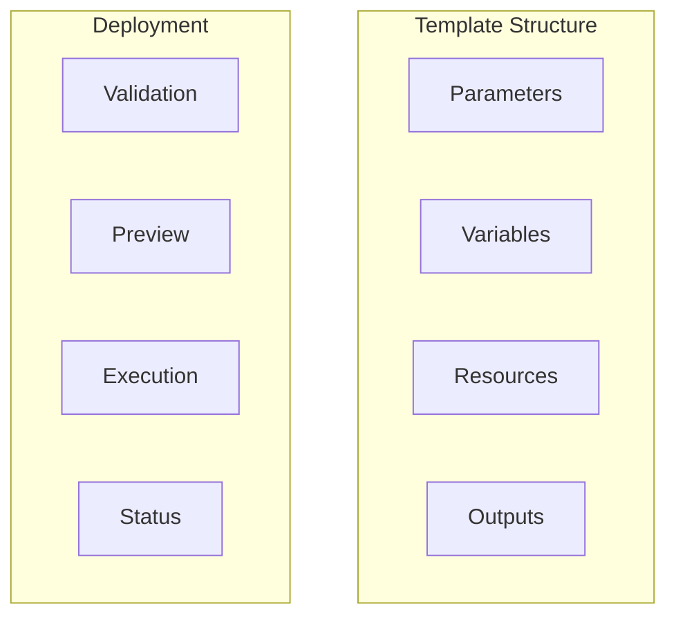

### 2. Bicep Templates
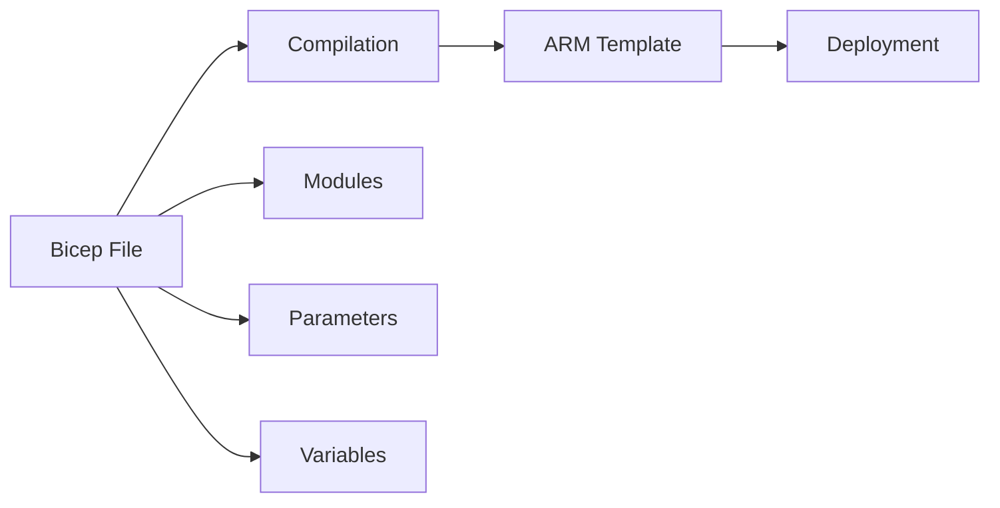

## Access Control

### 1. RBAC Implementation
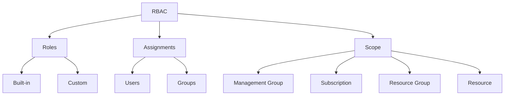

### 2. Policy Management
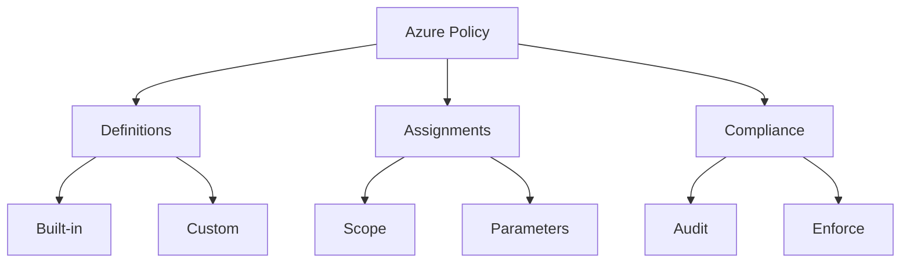

## Deployment Strategies

### 1. Resource Deployment
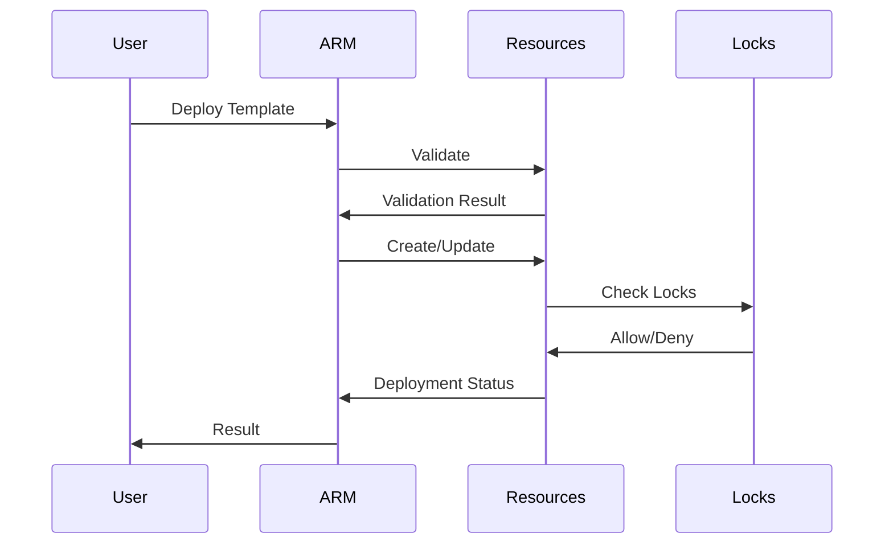

### 2. Multi-region Deployment
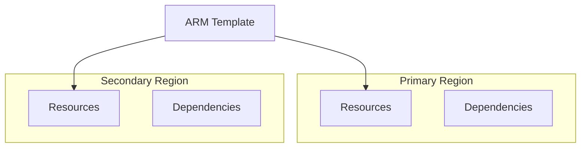

## Best Practices

### 1. Resource Organization
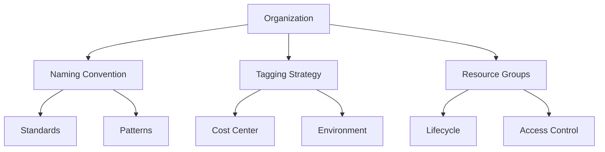

### 2. Template Management
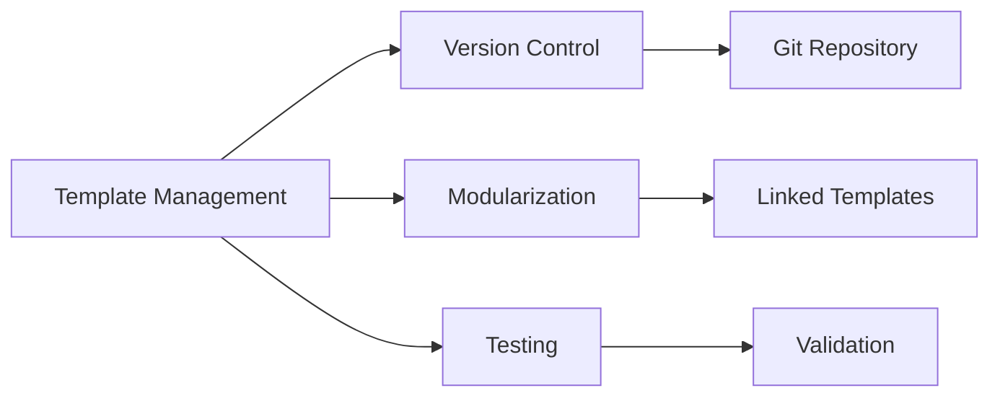

## Cost Management

### 1. Resource Monitoring
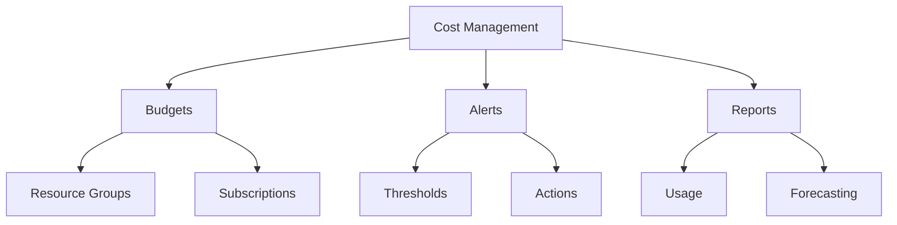

### 2. Cost Optimization
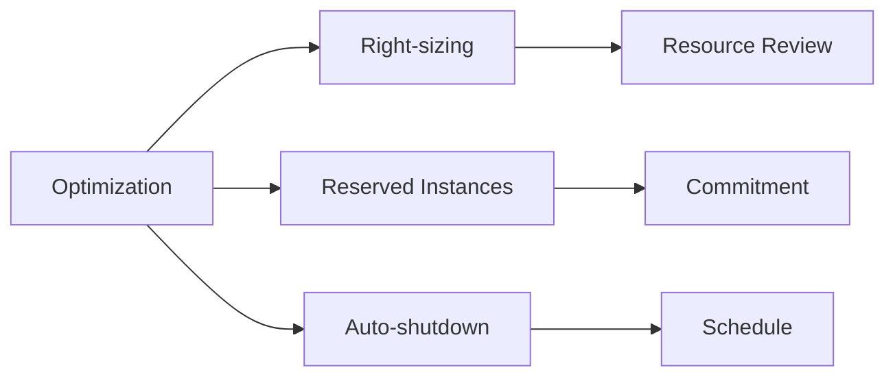

## Troubleshooting

### 1. Common Issues
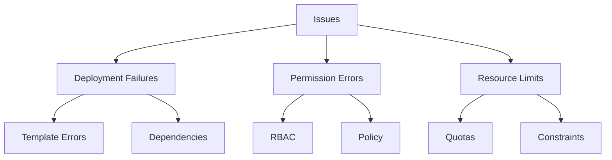

### 2. Diagnostic Tools
- Activity Logs
- Resource Health
- Deployment History
- ARM Template Toolkit

## Integration Patterns

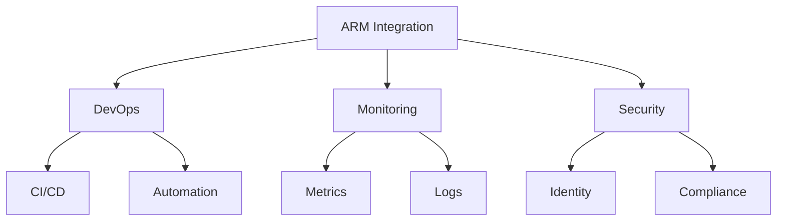

## Best Practices Summary

1. **Resource Organization**
   - Use consistent naming conventions
   - Implement comprehensive tagging
   - Group resources logically
   - Document dependencies

2. **Access Control**
   - Follow least privilege principle
   - Use built-in roles when possible
   - Regular access reviews
   - Implement proper inheritance

3. **Template Management**
   - Version control all templates
   - Use parameter files
   - Implement proper testing
   - Document dependencies

## Further Reading
- [Azure Resource Manager Documentation](https://learn.microsoft.com/en-us/azure/azure-resource-manager/)
- [ARM Template Best Practices](https://learn.microsoft.com/en-us/azure/azure-resource-manager/templates/best-practices)
- [Resource Naming Conventions](https://learn.microsoft.com/en-us/azure/cloud-adoption-framework/ready/azure-best-practices/resource-naming)