# Azure Storage Accounts

Azure Storage Accounts provide scalable and secure cloud storage for modern applications. They offer various storage services including Blob Storage for unstructured data, File Storage for managed file shares, Queue Storage for messaging, and Table Storage for NoSQL data. With features like data redundancy, encryption, and fine-grained access control, Storage Accounts form the foundation for Azure's data storage solutions.

## Overview
Azure Storage Account is a fundamental storage solution in Azure that contains all your Azure Storage data objects: blobs, files, queues, and tables. The storage account provides a unique namespace for your Azure Storage data that is accessible from anywhere in the world over HTTP or HTTPS.

## Core Components

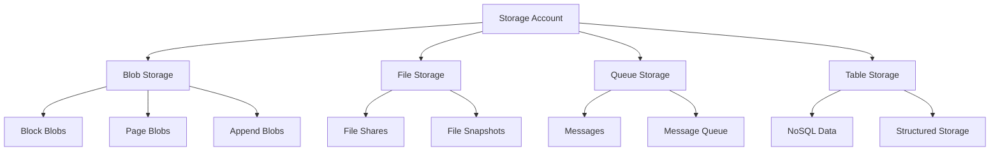

## Storage Types and Use Cases

### 1. Blob Storage
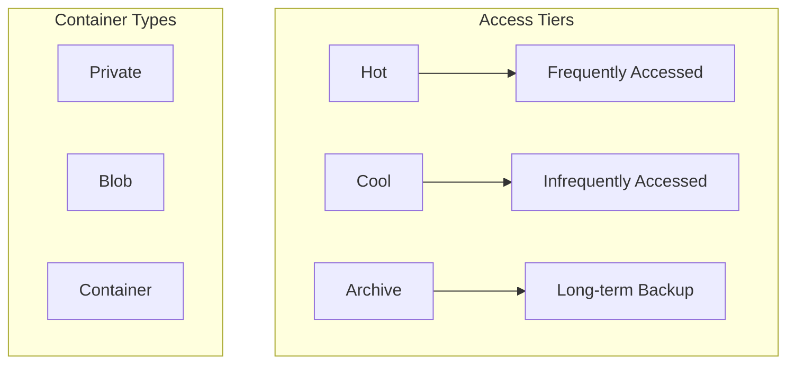

### 2. File Storage
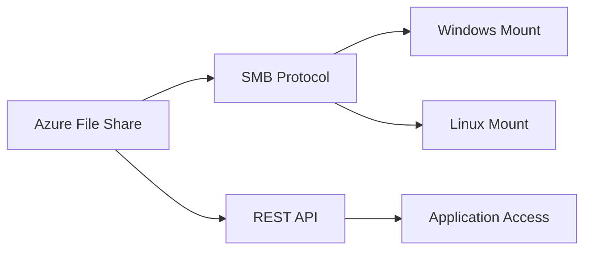

### 3. Queue Storage
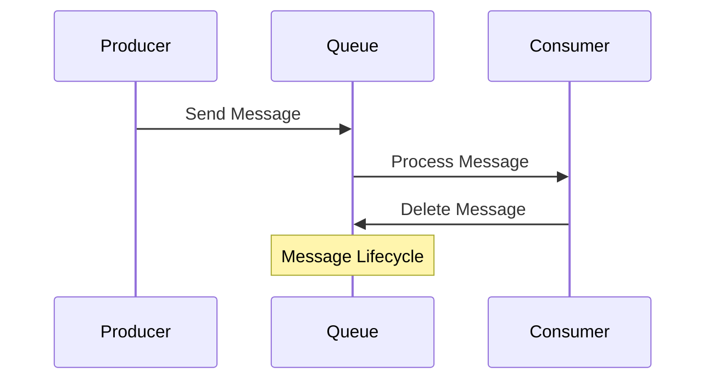

## Security Features

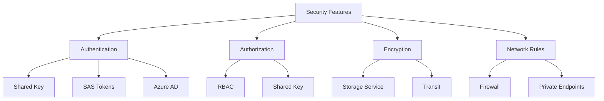

## Implementation Examples

### 1. Static Website Hosting
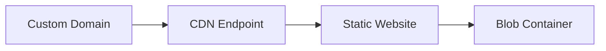

### 2. Backup Solution
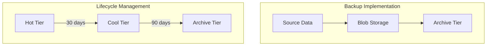

## Best Practices

### 1. Performance Optimization
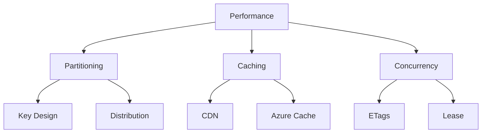

### 2. Cost Management
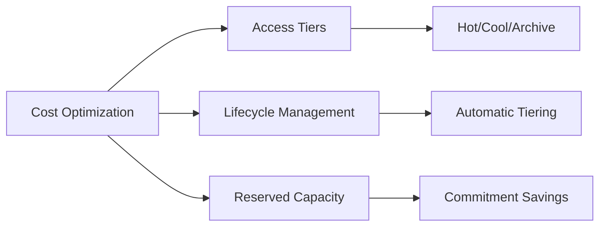

## Data Protection

### 1. Backup and Recovery
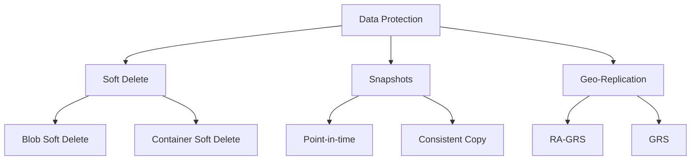

### 2. Redundancy Options
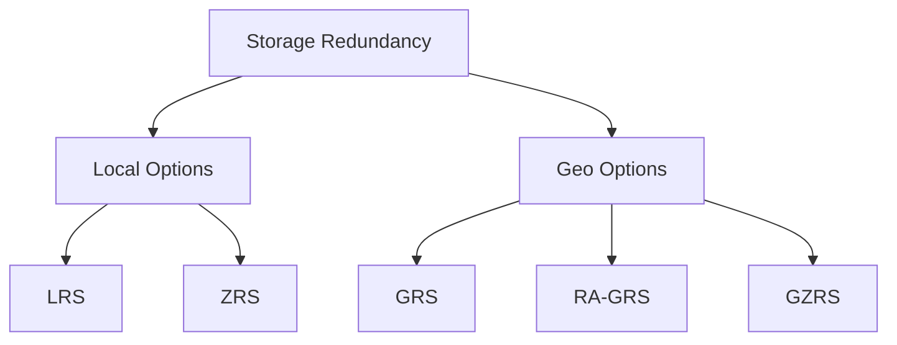

## Monitoring and Diagnostics

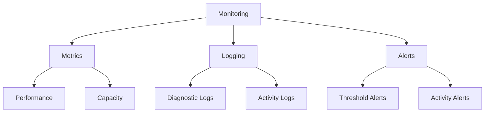

## Integration Patterns

### 1. Application Integration
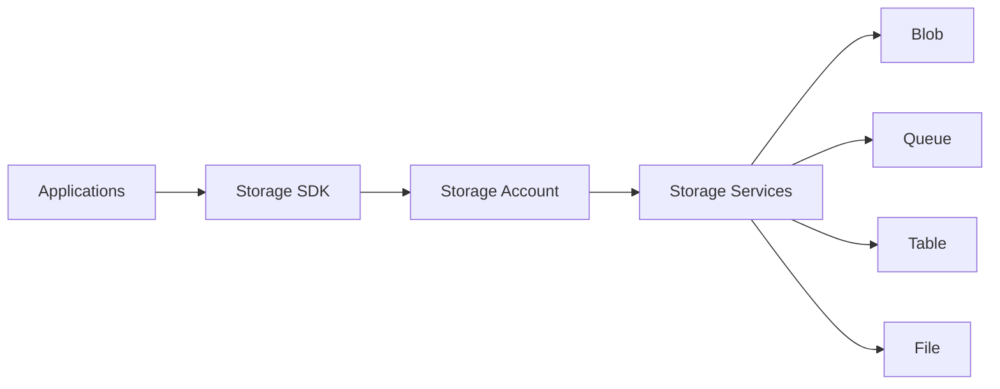

### 2. Service Integration
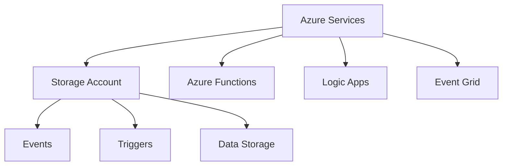

## Security Best Practices

1. **Access Management**
   - Use Azure AD authentication
   - Implement RBAC
   - Use SAS tokens with expiration
   - Enable Secure transfer

2. **Network Security**
   - Configure network rules
   - Use private endpoints
   - Implement service endpoints
   - Configure firewalls

3. **Data Protection**
   ```mermaid
   graph TB
       A[Data Protection] --> B[Encryption]
       A --> C[Access Control]
       A --> D[Monitoring]
       
       B --> E[Rest]
       B --> F[Transit]
       
       C --> G[RBAC]
       C --> H[SAS]
       
       D --> I[Auditing]
       D --> J[Logging]
   ```

## Troubleshooting Guide

1. **Common Issues**
   - Access denied errors
   - Performance problems
   - Connectivity issues
   - Capacity limits

2. **Diagnostic Tools**
   - Storage Explorer
   - Azure Monitor
   - Network tools
   - Metrics dashboard

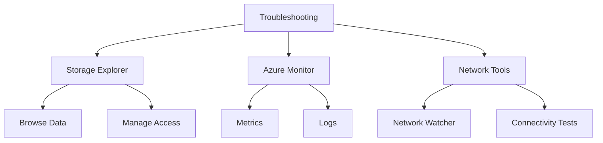

## Further Reading
- [Azure Storage Documentation](https://learn.microsoft.com/en-us/azure/storage/)
- [Storage Security Best Practices](https://learn.microsoft.com/en-us/azure/storage/blobs/security-recommendations)
- [Performance Guidelines](https://learn.microsoft.com/en-us/azure/storage/blobs/storage-performance-checklist)