# Azure Storage Security

Azure Storage Security provides comprehensive protection for your data at rest and in transit. It includes features like encryption, access control, network security, and key management to ensure your storage resources remain secure and compliant. From shared access signatures to Microsoft Entra integration, these security capabilities help safeguard your data across all storage services.

## Overview
Azure Storage Security encompasses multiple layers of protection including encryption, access control, network security, and data protection features to ensure the confidentiality, integrity, and availability of data stored in Azure Storage services.

## Core Security Components

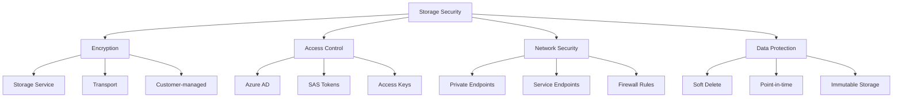

## Encryption Mechanisms

### 1. Storage Service Encryption
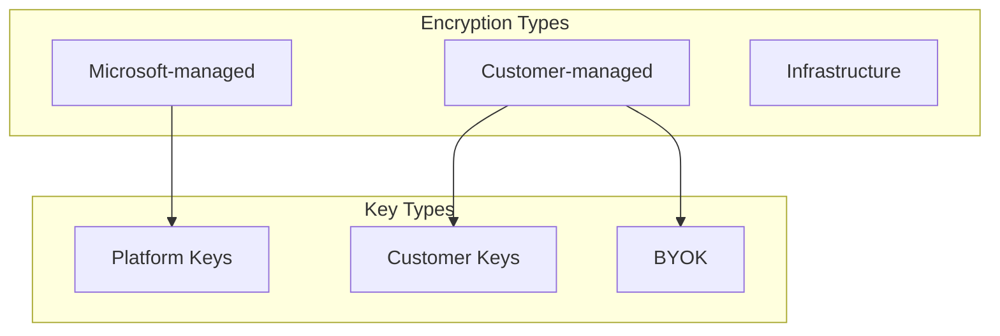

### 2. Transport Security
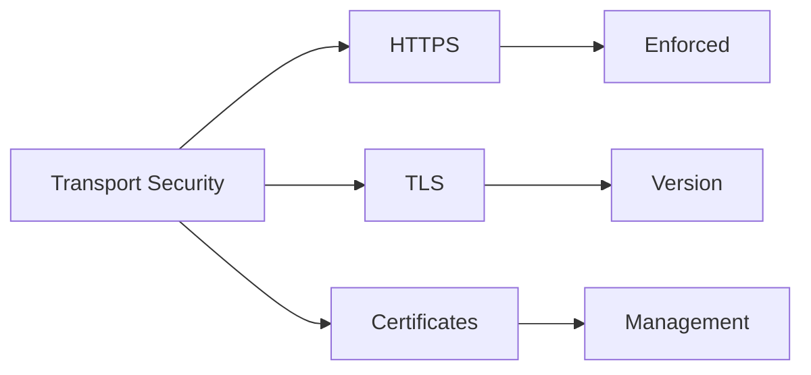

## Access Control

### 1. Authentication Methods
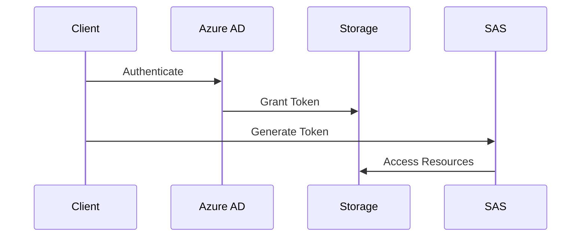

### 2. Authorization Mechanisms
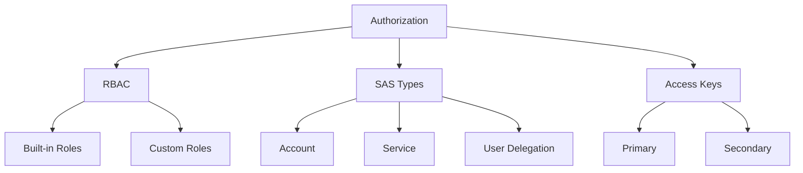

## Network Security

### 1. Network Access
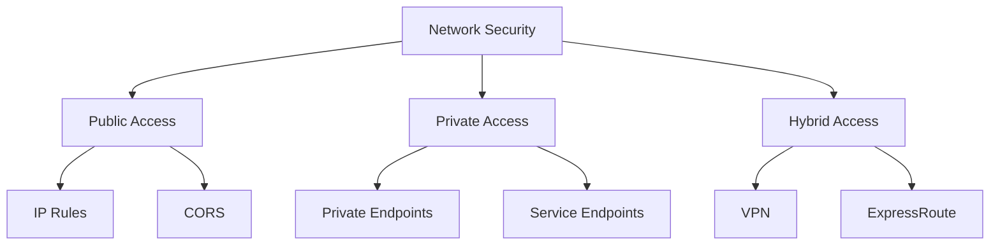

### 2. Firewall Configuration
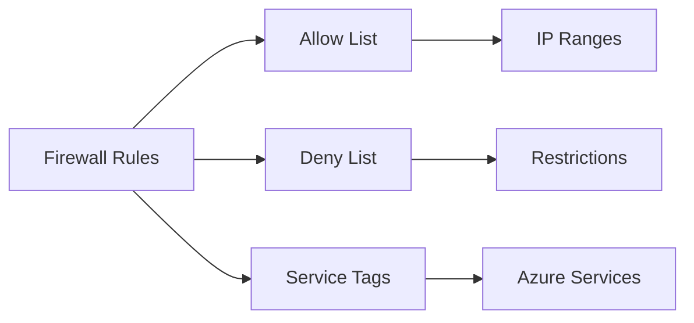

## Data Protection Features

### 1. Backup and Recovery
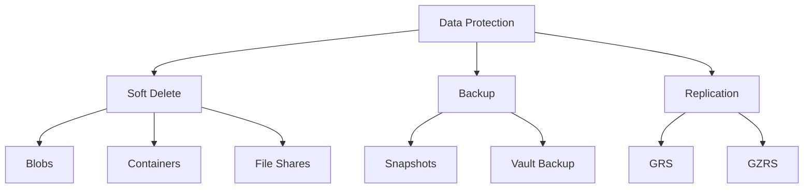

### 2. Data Immutability
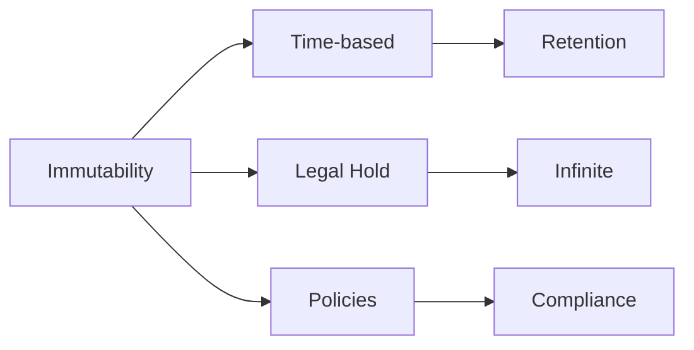

## Monitoring and Audit

### 1. Activity Monitoring
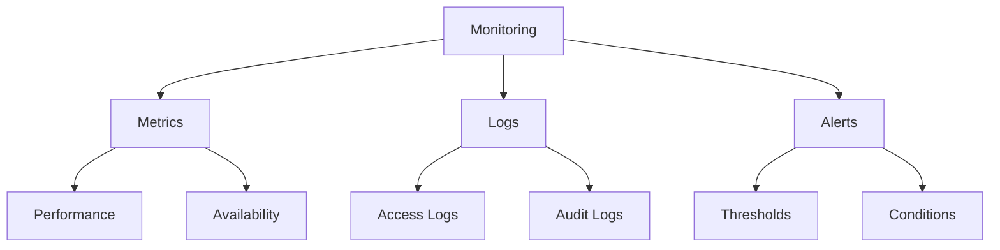

### 2. Security Assessment
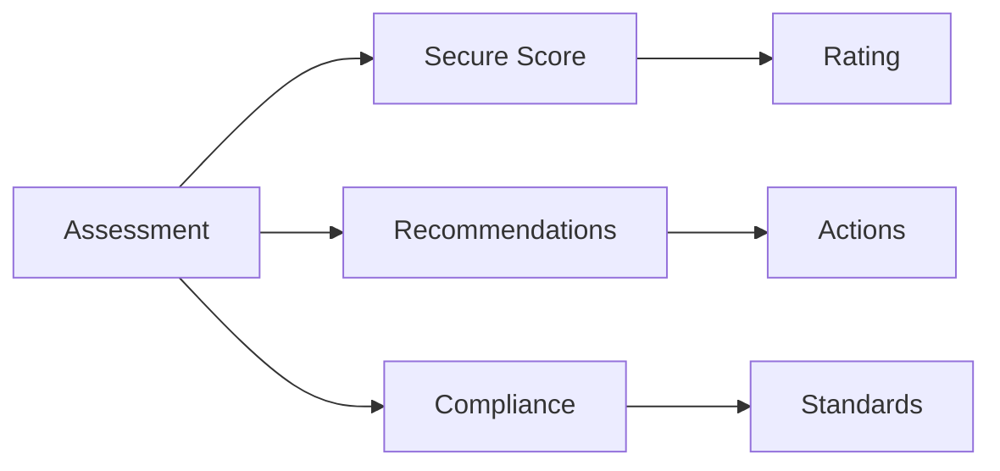

## Shared Access Signatures

### 1. SAS Types
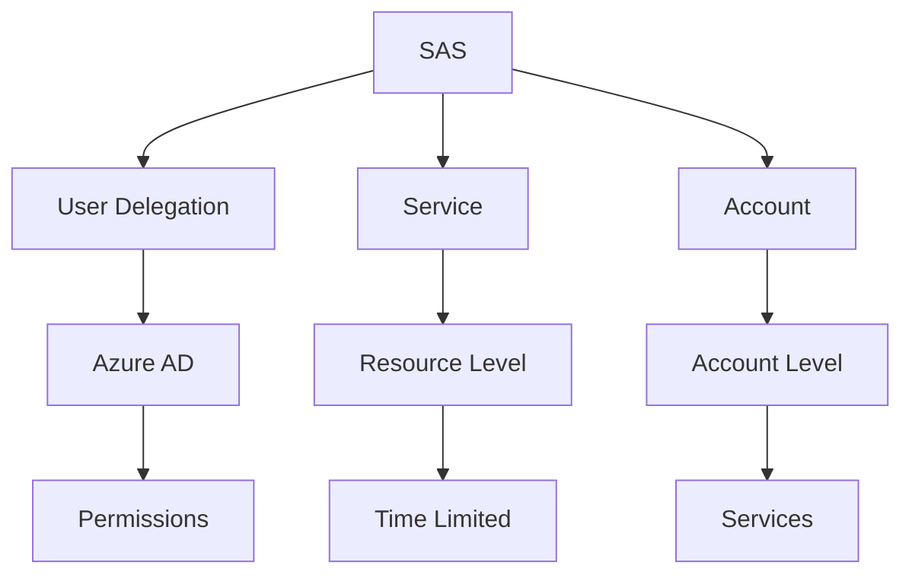

### 2. SAS Security
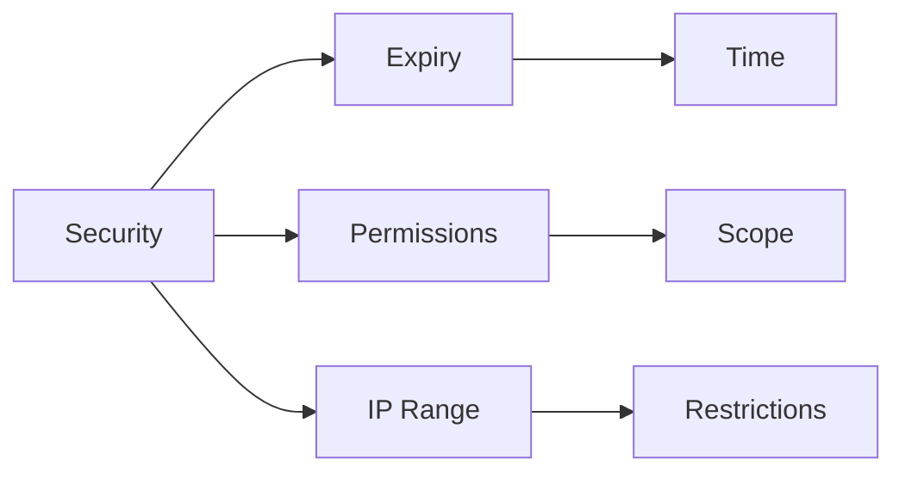

## Advanced Security Features

### 1. Advanced Threat Protection
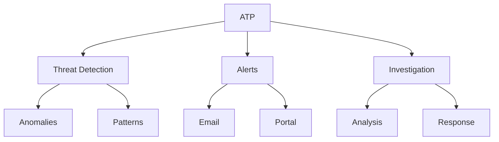

### 2. Security Operations
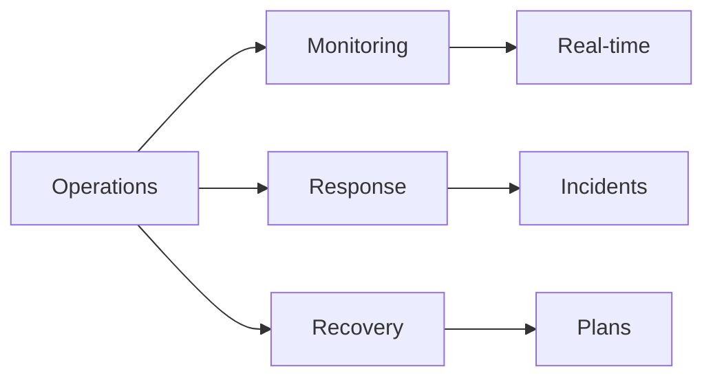

## Best Practices Summary

1. **Access Management**
   - Use Azure AD authentication
   - Implement least privilege
   - Rotate access keys
   - Use SAS with restrictions

2. **Data Protection**
   - Enable soft delete
   - Configure backup
   - Use immutable storage
   - Implement replication

3. **Network Security**
   - Use private endpoints
   - Configure firewalls
   - Restrict public access
   - Enable encryption

## Implementation Guidelines

### 1. Security Implementation
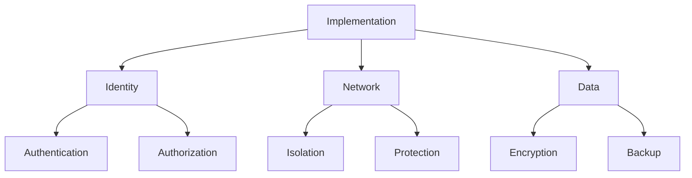

### 2. Operation Guidelines
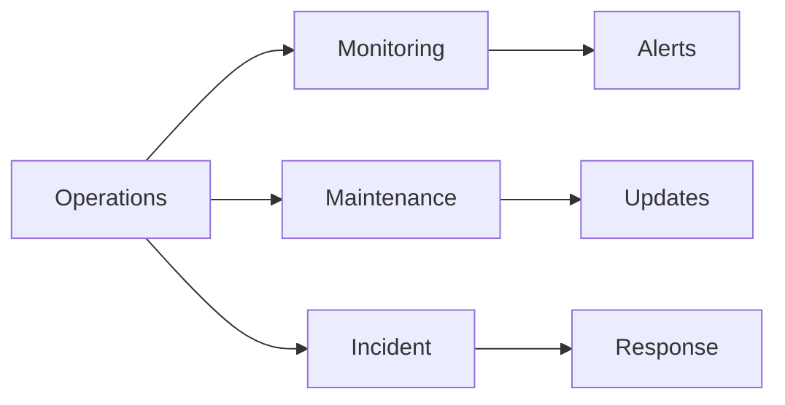

## Further Reading
- [Azure Storage Security Guide](https://learn.microsoft.com/en-us/azure/storage/common/storage-security-guide)
- [Data Protection Best Practices](https://learn.microsoft.com/en-us/azure/storage/common/storage-disaster-recovery-guidance)
- [Storage Encryption Documentation](https://learn.microsoft.com/en-us/azure/storage/common/storage-service-encryption)