# Azure Traffic Manager

Azure Traffic Manager is a DNS-based traffic load balancer that enables you to distribute traffic optimally to services across global Azure regions while providing high availability and responsiveness. Operating at the DNS level, Traffic Manager offers various routing methods to distribute traffic across multiple deployments of your application.

## Overview

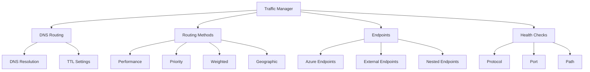

## Routing Methods

### 1. Performance Routing
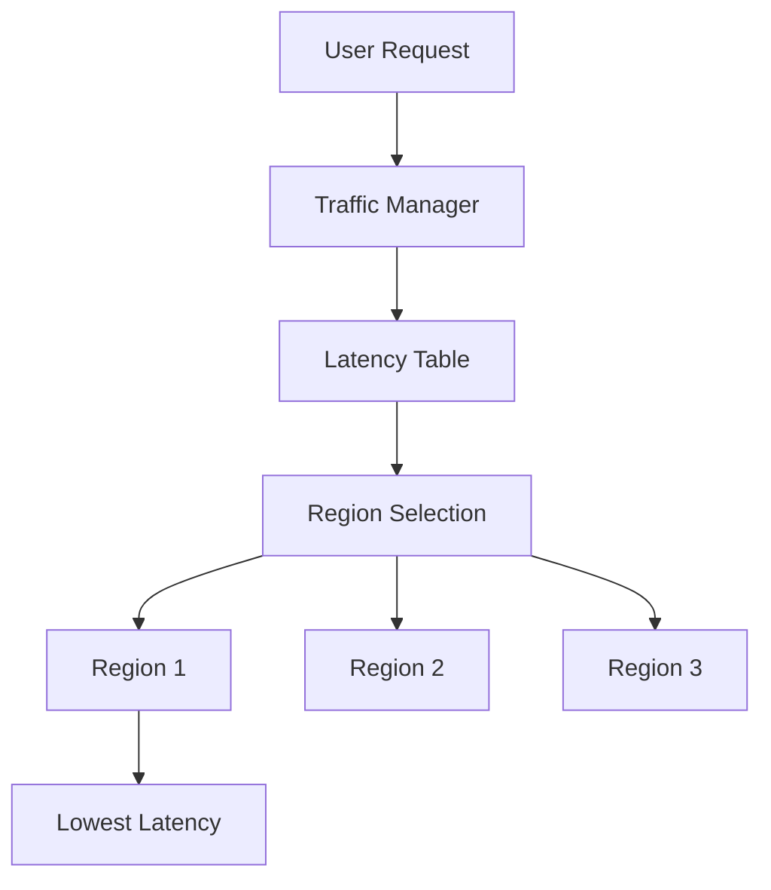

### 2. Geographic Routing
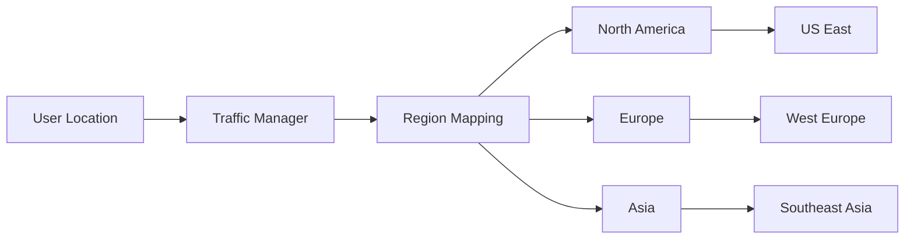

### 3. Priority Routing
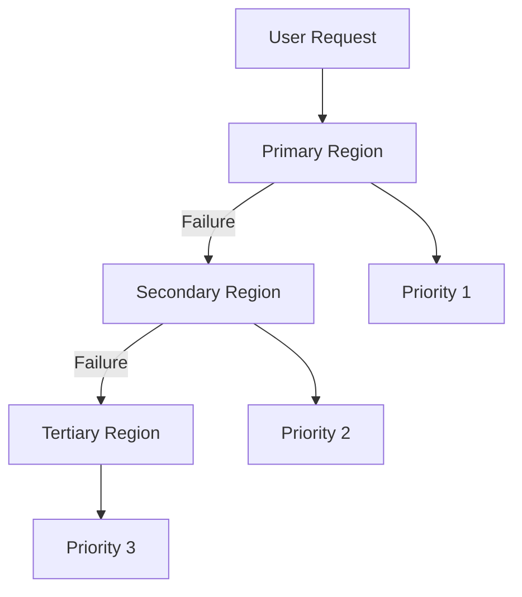

### 4. Weighted Routing
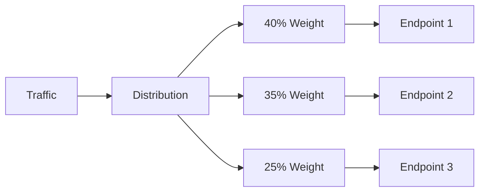

## High Availability Design

### 1. Nested Profiles
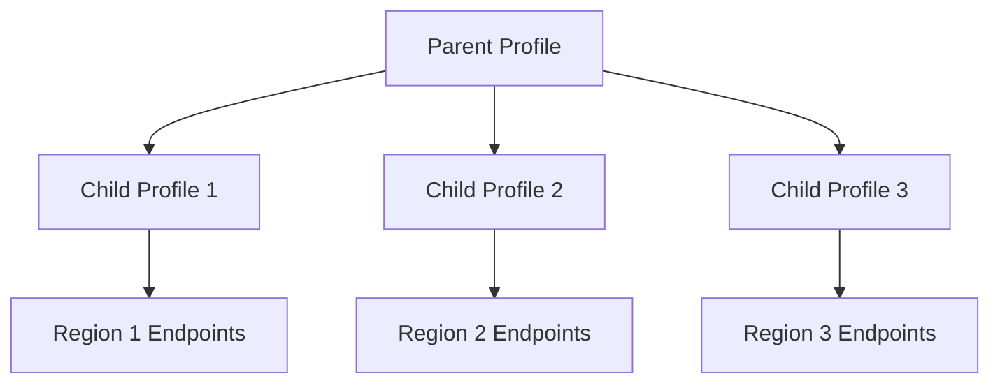

### 2. Health Checks
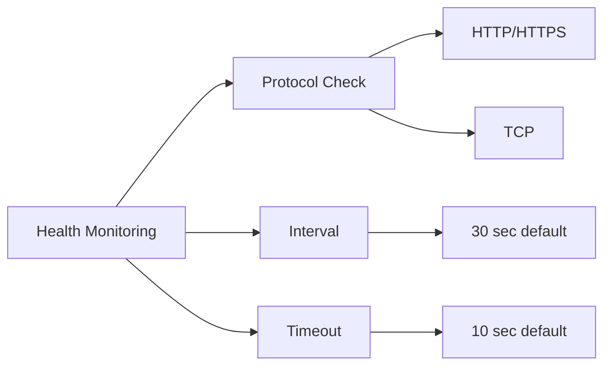

## Metrics and Monitoring

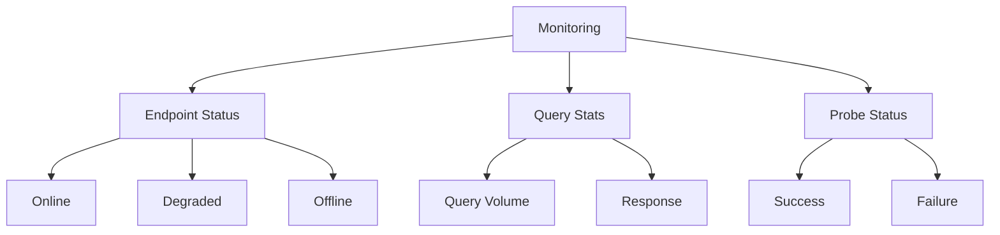

## Common Use Cases

### 1. Global Load Balancing
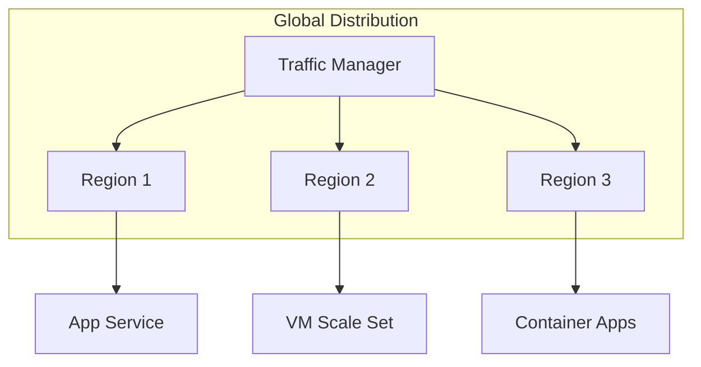

### 2. Disaster Recovery
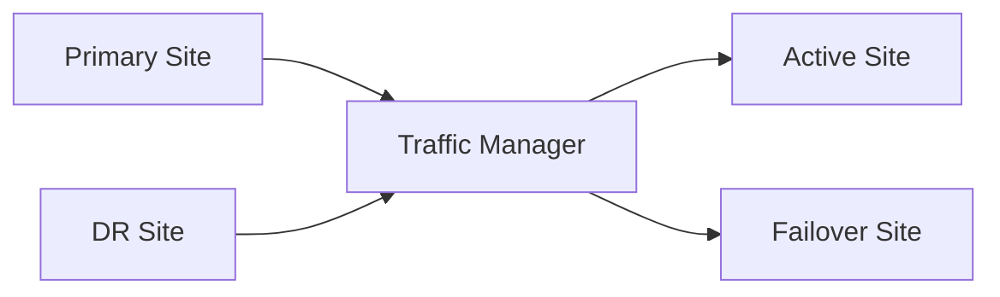

## Best Practices

1. **Configuration Guidelines**
   - Set appropriate TTL values
   - Configure proper health checks
   - Use nested profiles for complex scenarios
   - Implement proper monitoring

2. **Performance Optimization**
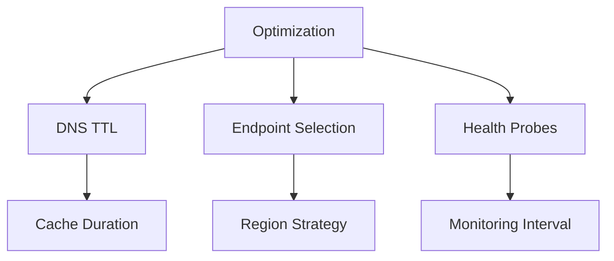

3. **Cost Management**
   - Monitor endpoint distribution
   - Optimize routing methods
   - Regular performance review
   - Clean up unused profiles

## Security Considerations

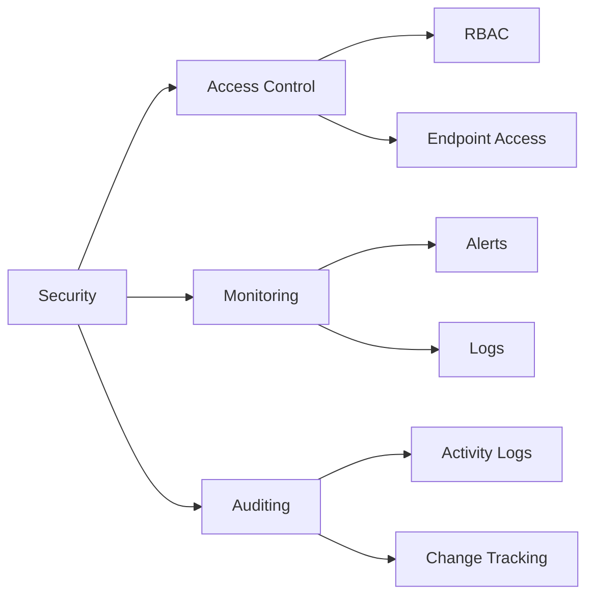

## Integration Patterns

### 1. Multi-Region Applications
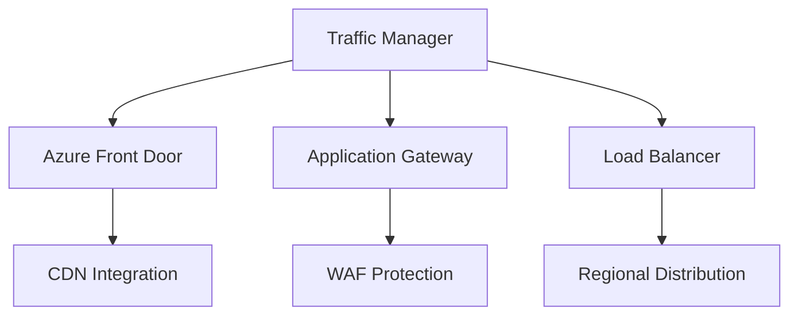

### 2. Hybrid Deployments
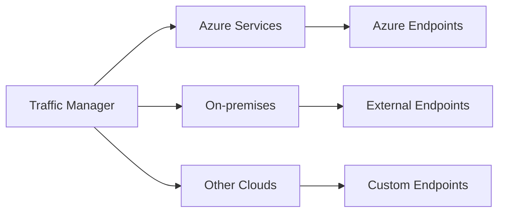

## Troubleshooting Guide

1. **Common Issues**
   - DNS resolution problems
   - Health probe failures
   - Endpoint availability
   - Performance degradation

2. **Resolution Steps**
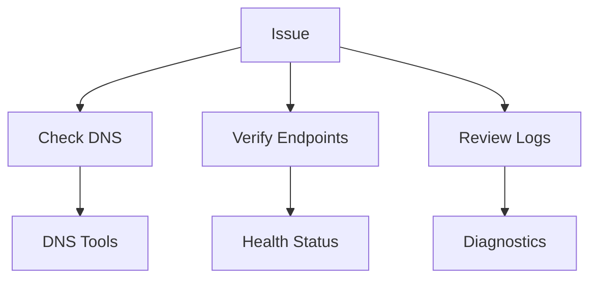

## Further Reading
- [Traffic Manager Documentation](https://learn.microsoft.com/en-us/azure/traffic-manager/)
- [Performance Routing Guide](https://learn.microsoft.com/en-us/azure/traffic-manager/traffic-manager-routing-methods)
- [Monitoring Best Practices](https://learn.microsoft.com/en-us/azure/traffic-manager/traffic-manager-monitoring)