# Azure Traffic Manager

Azure Traffic Manager is a DNS-based traffic load balancer that enables you to distribute traffic optimally to services across global Azure regions while providing high availability and responsiveness. As a DNS-based service, Traffic Manager directs the client to the appropriate service endpoint based on the chosen routing method.

## Overview

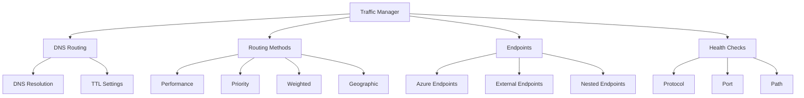

## Routing Methods in Detail

### 1. Performance Routing
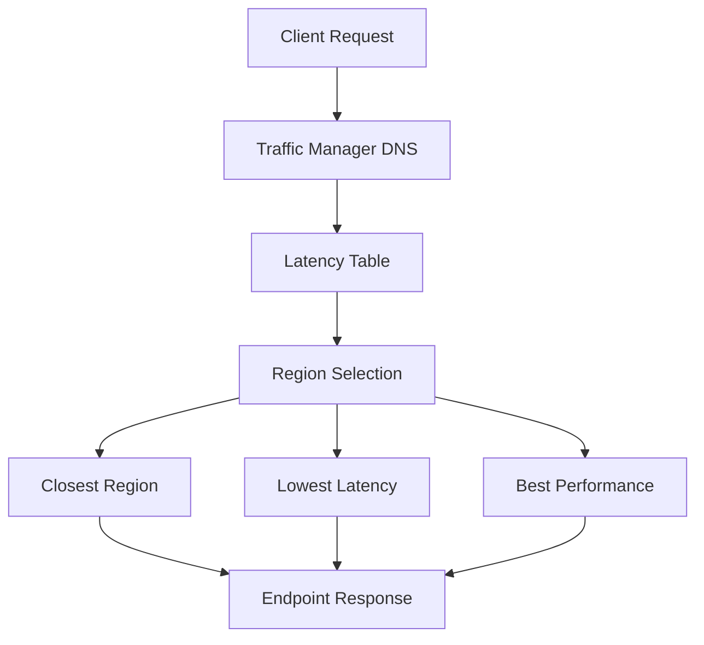

### 2. Geographic Routing
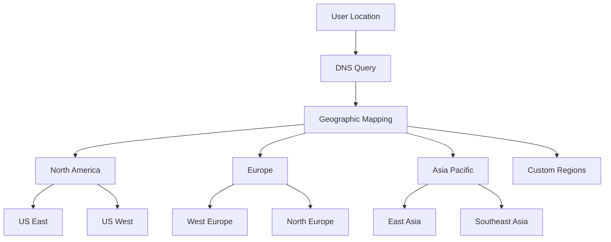

### 3. Priority Routing
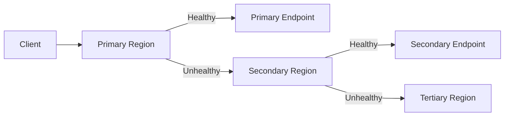

### 4. Weighted Routing
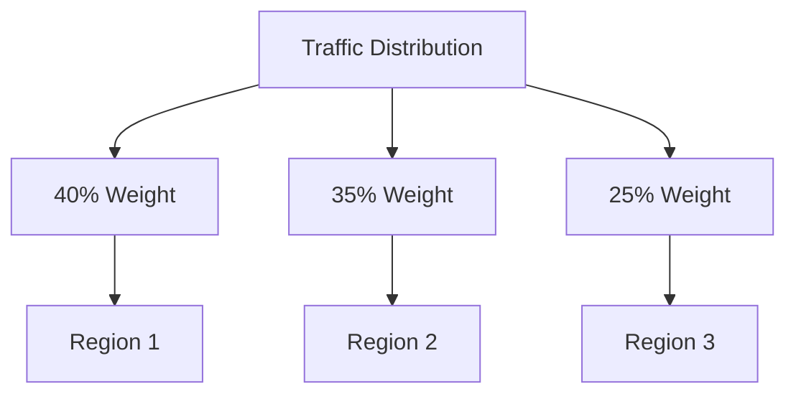

## Advanced Configuration

### 1. Nested Profiles
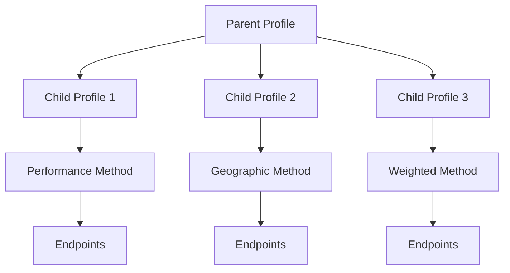

### 2. Endpoint Monitoring
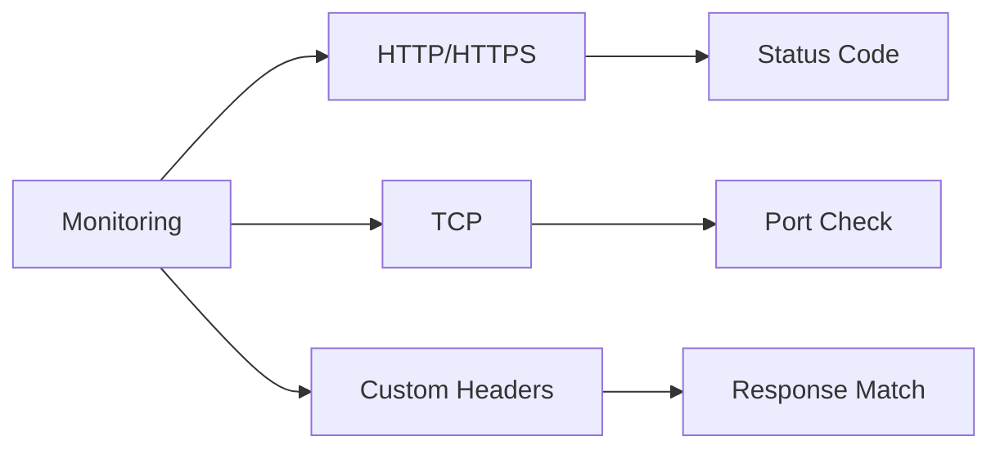

## Real-World Scenarios

### 1. Global Application Delivery
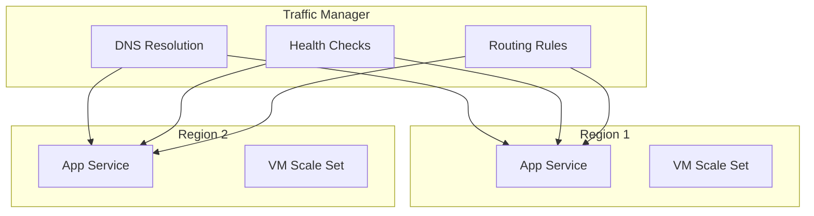

### 2. Disaster Recovery
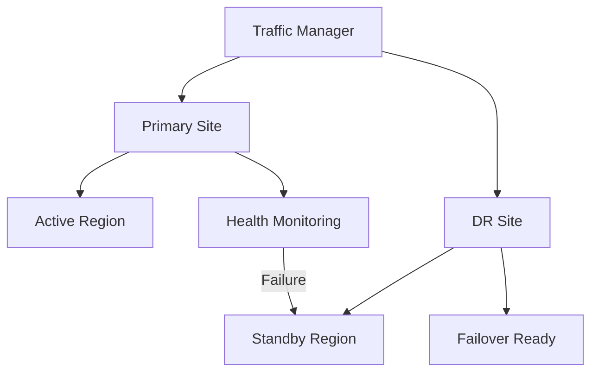

## Monitoring and Analytics

### 1. Health Status Dashboard
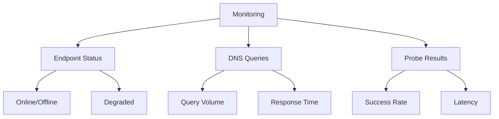

### 2. Performance Metrics
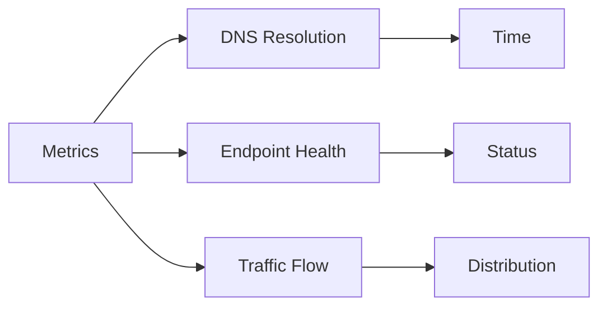

## Integration Patterns

### 1. Multi-Region Deployment
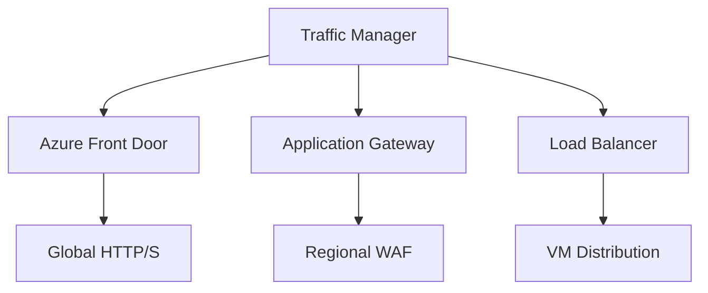

### 2. Hybrid Connectivity
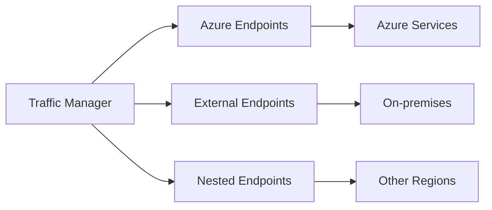

## Best Practices

1. **Configuration Guidelines**
   - Set appropriate TTL values
   - Configure meaningful health probes
   - Implement proper monitoring
   - Plan for failover scenarios

2. **Performance Optimization**
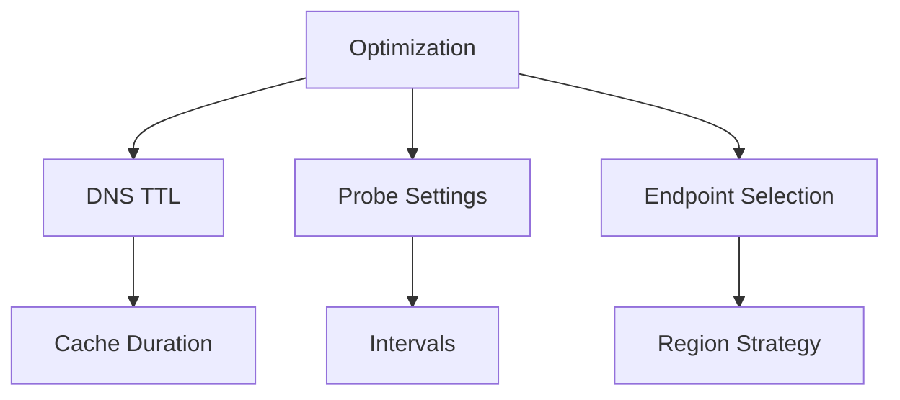

## Further Reading
- [Traffic Manager Overview](https://learn.microsoft.com/en-us/azure/traffic-manager/traffic-manager-overview)
- [Routing Methods Guide](https://learn.microsoft.com/en-us/azure/traffic-manager/traffic-manager-routing-methods)
- [Endpoint Monitoring](https://learn.microsoft.com/en-us/azure/traffic-manager/traffic-manager-monitoring)