# Azure VNet Gateway and Route-Based VPN

Azure Virtual Network Gateway provides essential VPN capabilities for connecting your on-premises networks to Azure through secure, encrypted tunnels. Route-based VPNs, the preferred VPN type in Azure, offer enhanced flexibility and advanced features compared to policy-based VPNs, making them ideal for most enterprise scenarios.

## VNet Gateway Overview

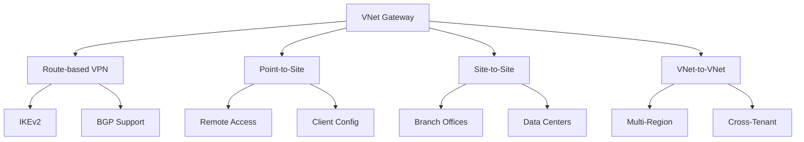

## Route-Based VPN Features

### 1. Core Capabilities
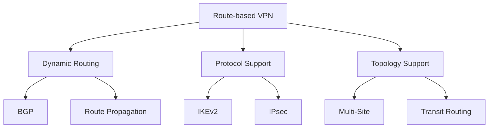

### 2. Authentication Methods
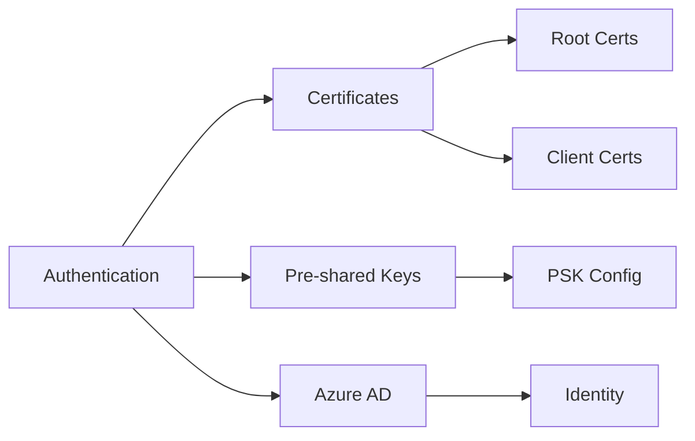

## Gateway SKUs and Performance

### 1. SKU Features
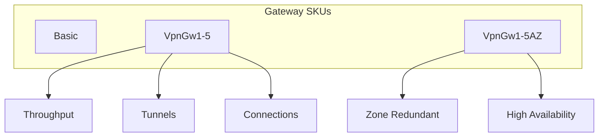

### 2. Performance Metrics
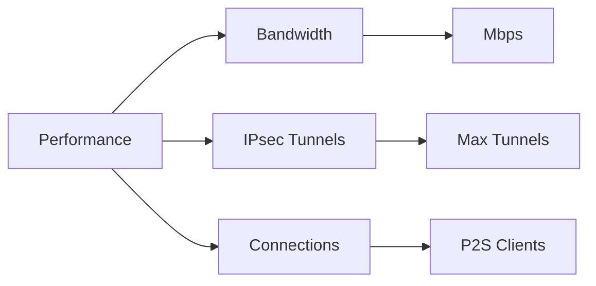

## Implementation Scenarios

### 1. Site-to-Site Configuration
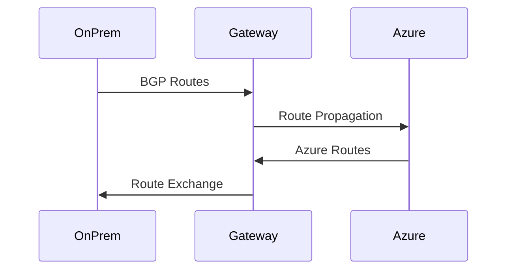

### 2. Multi-Site Setup
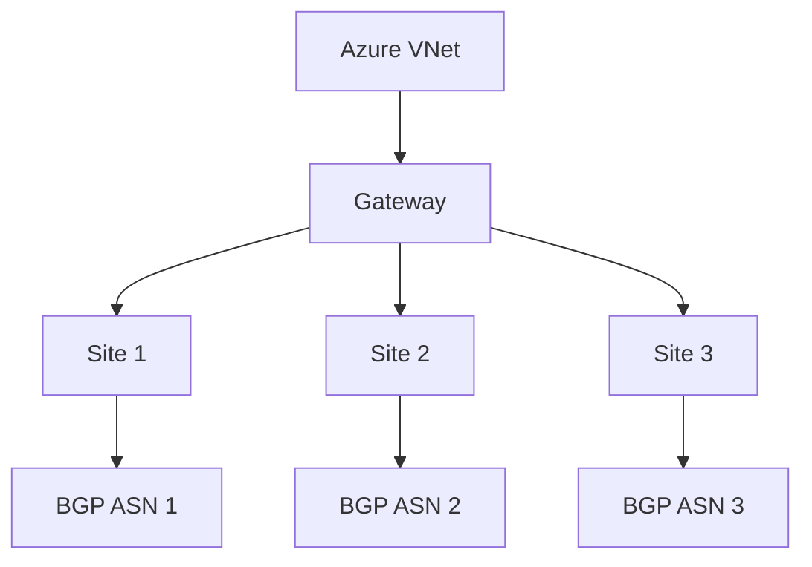

## High Availability Design

### 1. Active-Active Configuration
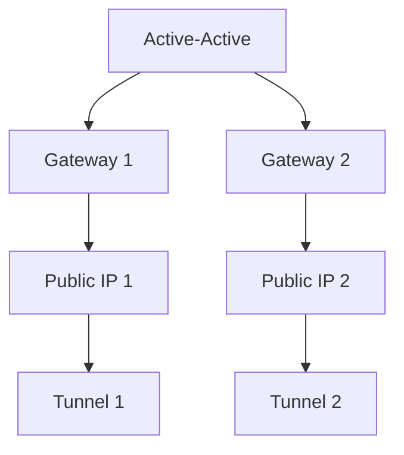

### 2. Zone-Redundant Deployment
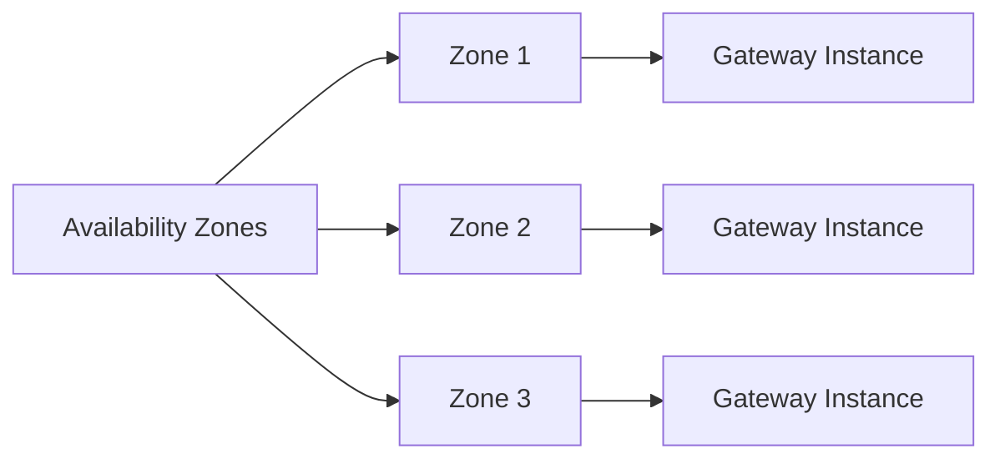

## BGP Configuration

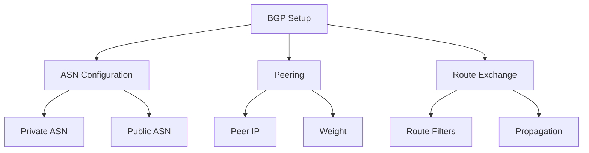

## Security Features

### 1. Encryption Configuration
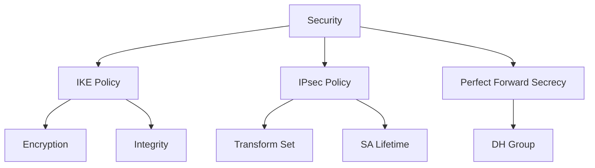

### 2. Network Security
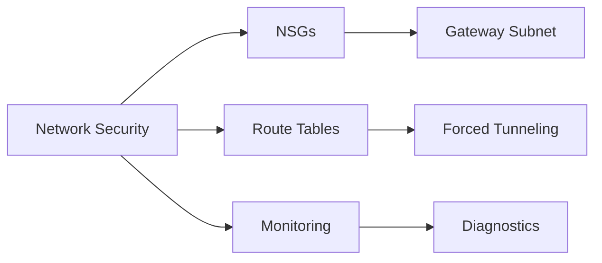

## Monitoring and Diagnostics

### 1. Gateway Metrics
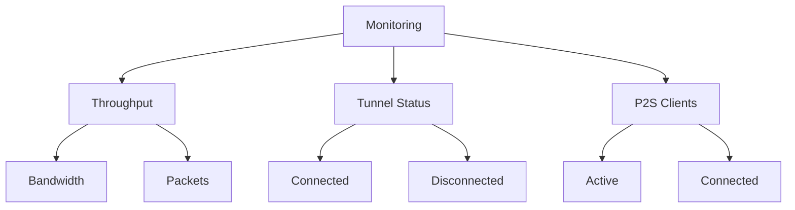

### 2. Diagnostic Logs
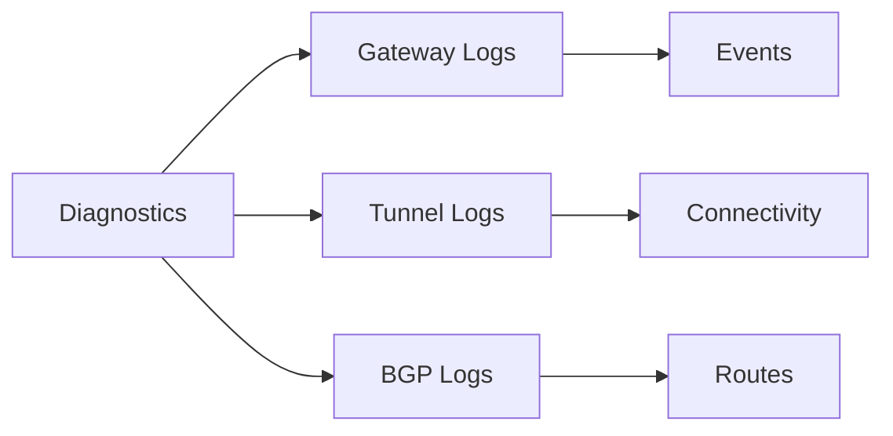

## Best Practices

1. **Design Considerations**
   - Choose appropriate SKU
   - Plan IP addressing
   - Consider BGP implementation
   - Design for high availability

2. **Security Guidelines**
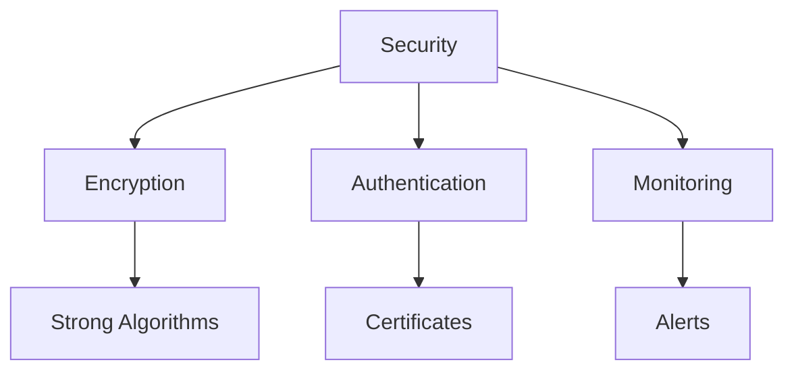

## Troubleshooting Guide

1. **Common Issues**
   - Connection drops
   - BGP route issues
   - Performance problems
   - Authentication failures

2. **Resolution Steps**
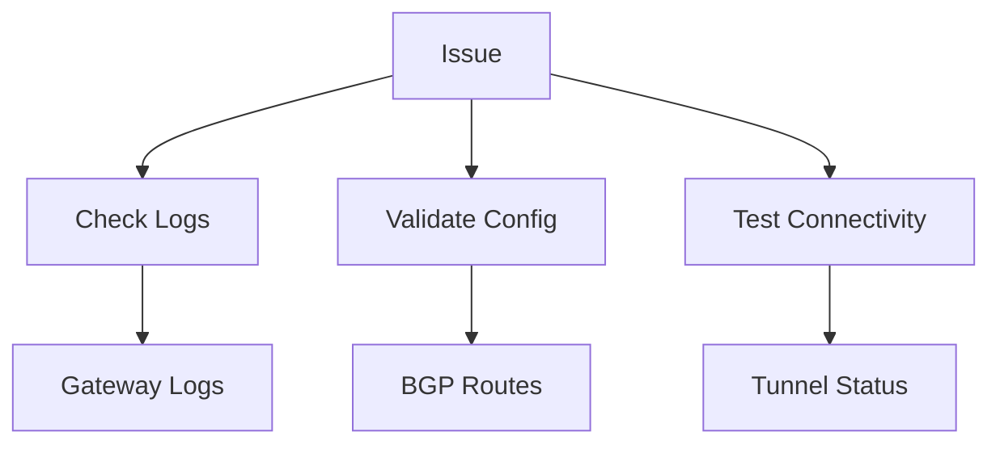

## Further Reading
- [VNet Gateway Documentation](https://learn.microsoft.com/en-us/azure/vpn-gateway/)
- [Route-Based VPN Guide](https://learn.microsoft.com/en-us/azure/vpn-gateway/vpn-gateway-about-vpn-gateway-settings)
- [BGP Configuration Guide](https://learn.microsoft.com/en-us/azure/vpn-gateway/vpn-gateway-bgp-overview)