# Azure Virtual Machines

## Overview
Azure Virtual Machines (VMs) provide on-demand, scalable computing resources. They support Windows, Linux, and custom images, allowing you to run virtually any workload in the cloud.

## Core Components

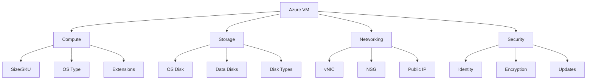

## VM Types and Sizes

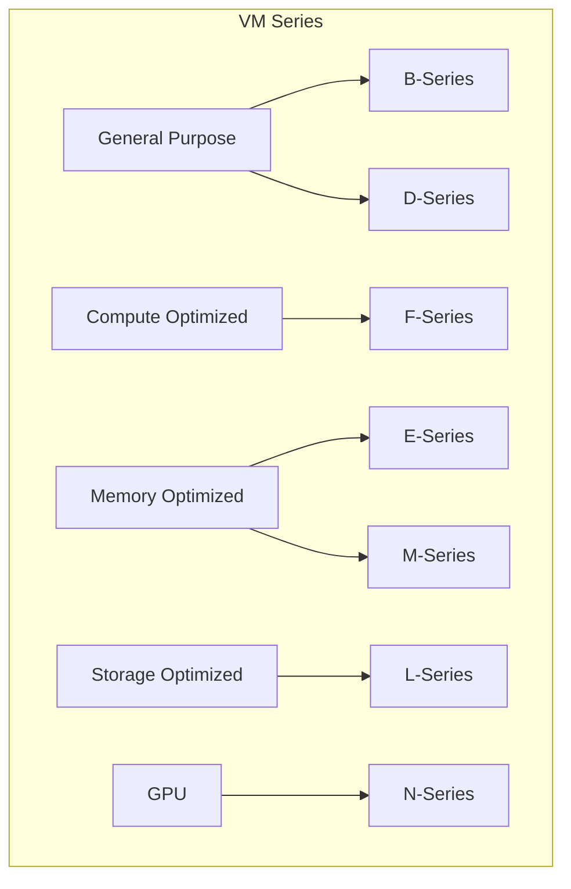

## Deployment Patterns

### 1. High Availability Setup
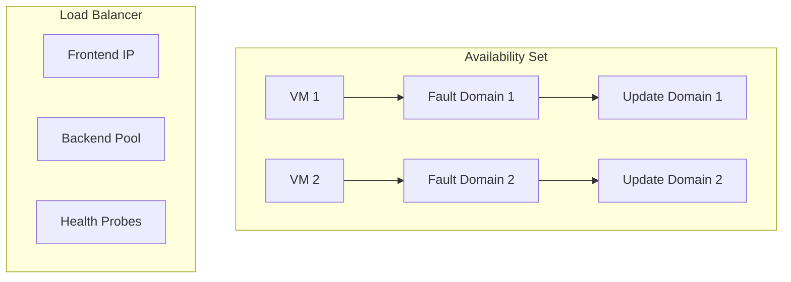

### 2. Scale Set Architecture
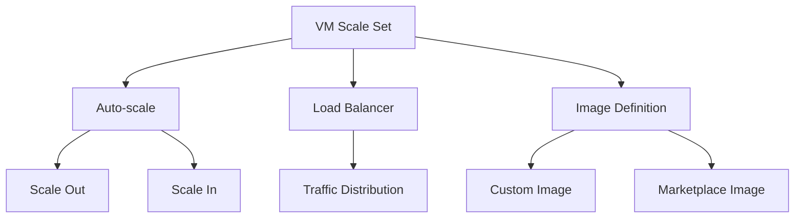

## Storage Configuration

### 1. Disk Types
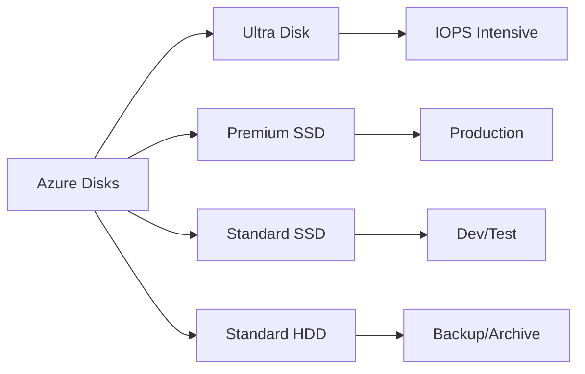

### 2. Storage Performance
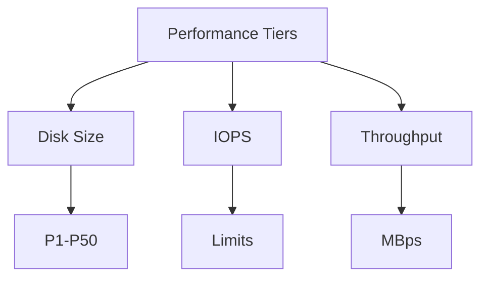

## Networking Features

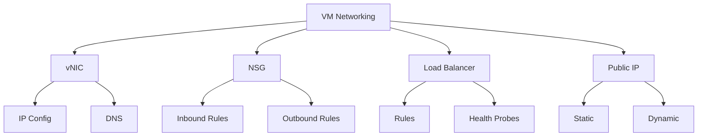

## Security Implementation

### 1. Identity and Access
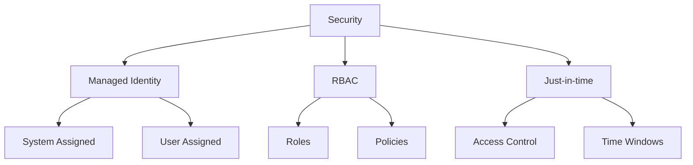

### 2. Encryption and Updates
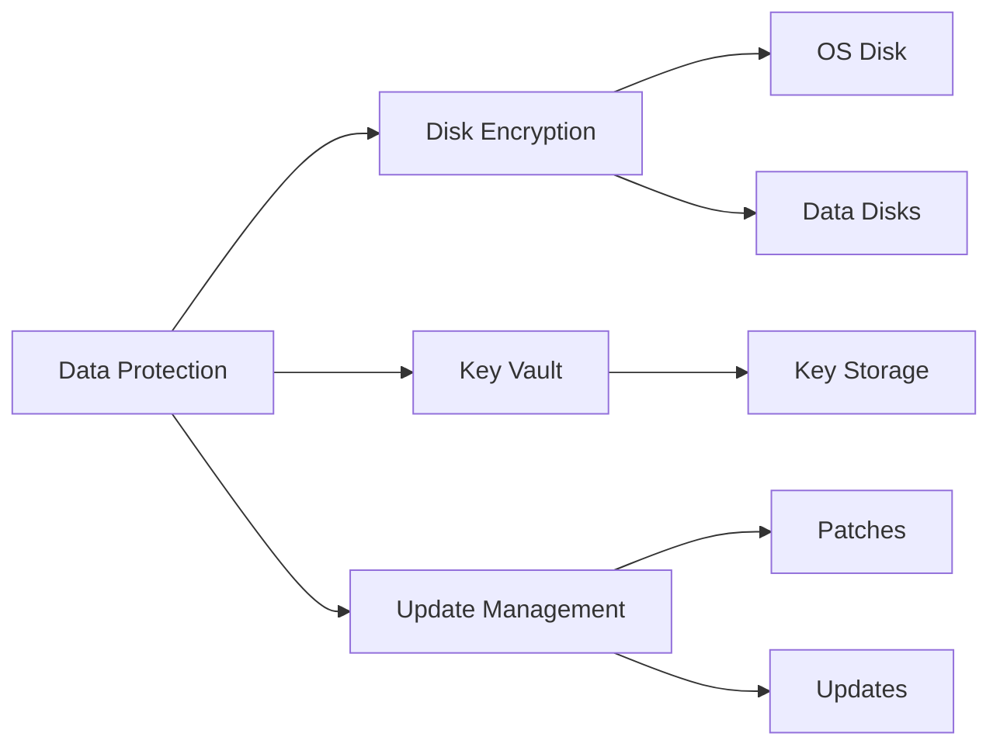

## Monitoring and Management

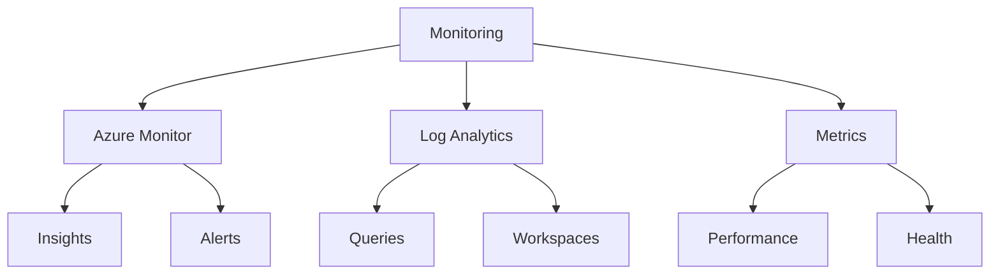

## Cost Optimization

### 1. Reserved Instances
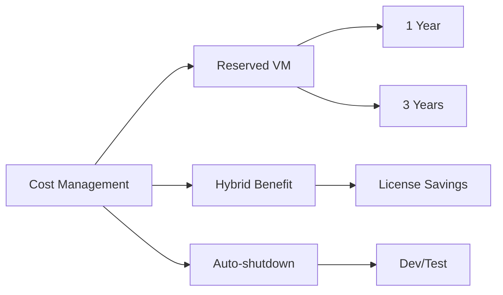

### 2. Scaling Strategies
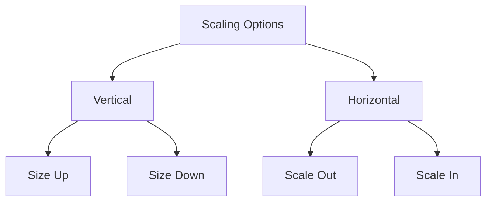

## Best Practices

1. **Resource Organization**
   - Use resource groups logically
   - Implement proper tagging
   - Follow naming conventions
   - Document configurations

2. **Performance Optimization**
   ```mermaid
   graph TB
       A[Optimization] --> B[Size Selection]
       A --> C[Storage Config]
       A --> D[Network Config]
       
       B --> E[Right-sizing]
       C --> F[Premium Storage]
       D --> G[Accelerated Networking]
   ```

3. **Disaster Recovery**
   - Implement backup strategy
   - Use availability sets/zones
   - Configure site recovery
   - Test recovery plans

## Troubleshooting Guide

### 1. Common Issues
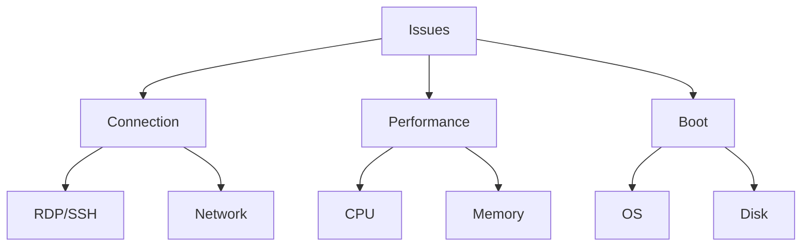

### 2. Diagnostic Tools
- Boot diagnostics
- Performance diagnostics
- Network Watcher
- Serial console

## Image Management

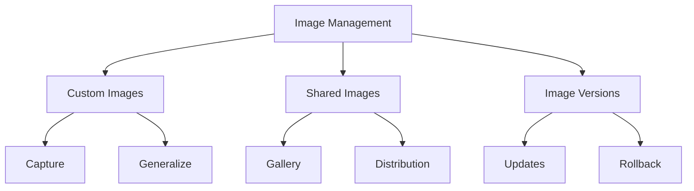

## Maintenance and Updates

1. **Planned Maintenance**
   - OS updates
   - Platform updates
   - Hardware updates
   - Network changes

2. **Update Management**
   ```mermaid
   graph LR
       A[Update Management] --> B[Assessment]
       B --> C[Scheduling]
       C --> D[Deployment]
       D --> E[Reporting]
   ```

## Integration with Azure Services

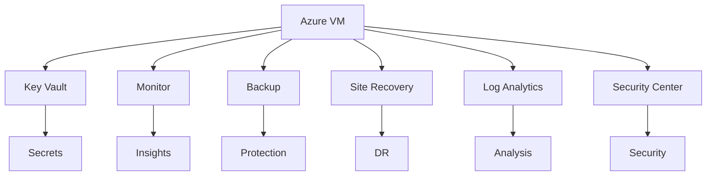

## Further Reading
- [Azure VM Documentation](https://learn.microsoft.com/en-us/azure/virtual-machines/)
- [VM Best Practices](https://learn.microsoft.com/en-us/azure/virtual-machines/best-practices)
- [VM Performance Guidelines](https://learn.microsoft.com/en-us/azure/virtual-machines/premium-storage-performance)