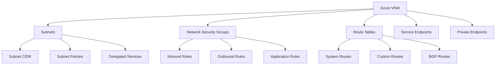
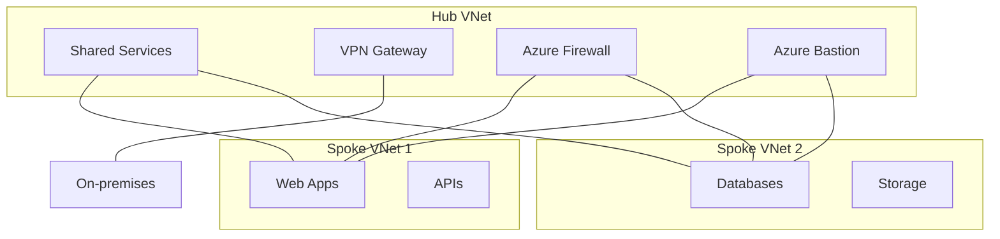
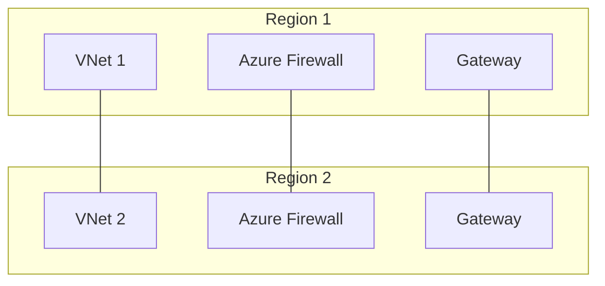
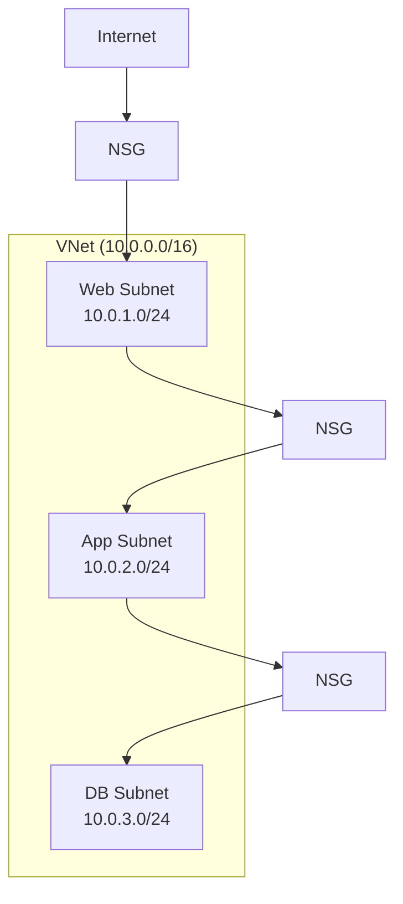
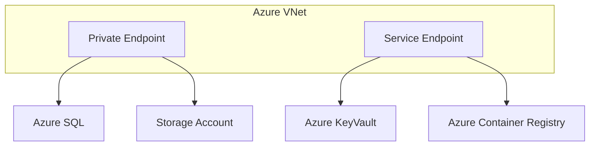
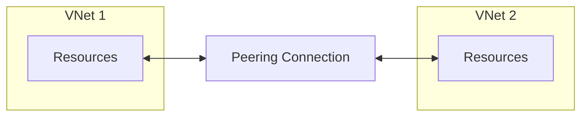
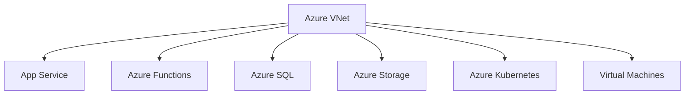

# Azure Virtual Networks (VNet)

Azure Virtual Networks (VNets) provide the fundamental building block for your private network in Azure. VNet enables many types of Azure resources to securely communicate with each other, the internet, and on-premises networks. Like a traditional network in your datacenter, VNet facilitates essential networking capabilities while adding Azure's scalability, availability, and security benefits.

## Overview
Azure Virtual Networks (VNets) are the fundamental building block for private networks in Azure. VNets enable Azure resources to securely communicate with each other, the internet, and on-premises networks.

## Core Components



## Network Architecture Patterns

### Hub-Spoke Network Topology



### Multi-Region Network Design



## Common Use Cases

1. **Application Segmentation**
   ```mermaid
   graph LR
       A[Frontend Subnet] --> B[NSG]
       B --> C[Backend Subnet]
       C --> D[NSG]
       D --> E[Database Subnet]
   ```

2. **Hybrid Connectivity**
   ```mermaid
   graph TB
       A[On-premises Network] --> B[VPN Gateway]
       B --> C[Azure VNet]
       C --> D[Azure Resources]
       A --> E[ExpressRoute]
       E --> C
   ```

3. **Micro-segmentation**
   ```mermaid
   graph TB
       A[Application NSG] --> B{Allow Rules}
       B --> C[Web Tier]
       B --> D[App Tier]
       B --> E[Data Tier]
       C --> F[Port 80/443]
       D --> G[Custom Ports]
       E --> H[SQL Port]
   ```

## Implementation Examples

### 1. Basic VNet Setup



### 2. Service Integration



## Best Practices

1. **Network Planning**
   - Plan address spaces carefully
   - Use subnet segregation
   - Implement network security groups
   - Enable network flow logs

2. **Security**
   ```mermaid
   graph TB
       A[Security Layers] --> B[NSGs]
       A --> C[Azure Firewall]
       A --> D[Application Gateway]
       B --> E[Rule Priority]
       C --> F[IDPS]
       D --> G[WAF]
   ```

3. **Monitoring**
   - Enable NSG flow logs
   - Configure Network Watcher
   - Set up alerts
   - Monitor network metrics

## Network Security Groups (NSG) Best Practices

1. **Rule Management**
   - Use service tags
   - Implement least privilege
   - Document rule changes
   - Regular rule review

2. **Default Rules**
   ```mermaid
   graph TB
       A[Default Rules] --> B[Allow VNet]
       A --> C[Allow LB]
       A --> D[Deny All]
       B --> E[Priority 65000]
       C --> F[Priority 65001]
       D --> G[Priority 65500]
   ```

3. **Application Rules**
   - Layer 7 filtering
   - Protocol restrictions
   - Port restrictions
   - Source/destination control

## VNet Peering



### Peering Types
1. **Regional VNet Peering**
   - Same region connectivity
   - Low latency
   - No gateway transit

2. **Global VNet Peering**
   - Cross-region connectivity
   - Higher latency
   - Gateway transit support

## Troubleshooting Tools

1. **Network Watcher**
   ```mermaid
   graph TB
       A[Network Watcher] --> B[Connection Monitor]
       A --> C[NSG Flow Logs]
       A --> D[IP Flow Verify]
       A --> E[Next Hop]
       A --> F[Packet Capture]
   ```

2. **Diagnostic Tools**
   - Network Performance Monitor
   - Connection Monitor
   - Network Security Group View
   - VNet Connectivity Tests

## Integration with Azure Services



## Security and Compliance

1. **Network Isolation**
   - Use private endpoints
   - Implement service endpoints
   - Configure NSGs
   - Enable Azure Firewall

2. **Access Control**
   ```mermaid
   graph TB
       A[Access Control] --> B[RBAC]
       A --> C[NSG Rules]
       A --> D[Service Endpoints]
       B --> E[Custom Roles]
       C --> F[Allow Lists]
       D --> G[Service Policies]
   ```

## Performance Optimization

1. **Accelerated Networking**
   - Enable for supported VM sizes
   - Monitor network metrics
   - Configure load balancing

2. **Route Optimization**
   ```mermaid
   graph TB
       A[Route Optimization] --> B[UDR]
       A --> C[BGP Routes]
       A --> D[System Routes]
       B --> E[Next Hop]
       C --> F[AS Path]
       D --> G[Default Routes]
   ```

## Further Reading
- [Azure Virtual Network Documentation](https://learn.microsoft.com/en-us/azure/virtual-network/)
- [Network Security Best Practices](https://learn.microsoft.com/en-us/azure/security/fundamentals/network-best-practices)
- [VNet Architecture Patterns](https://learn.microsoft.com/en-us/azure/architecture/reference-architectures/hybrid-networking/)