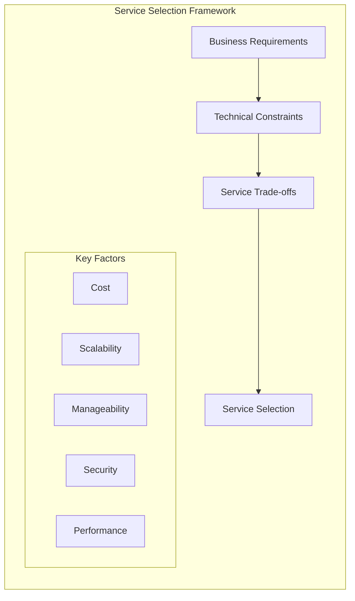
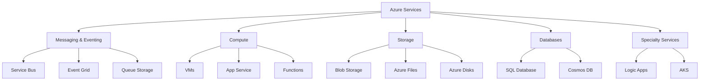
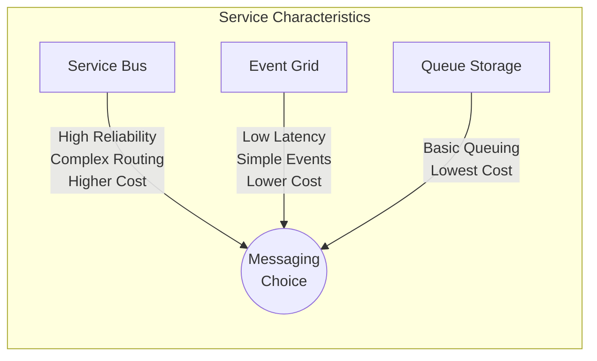
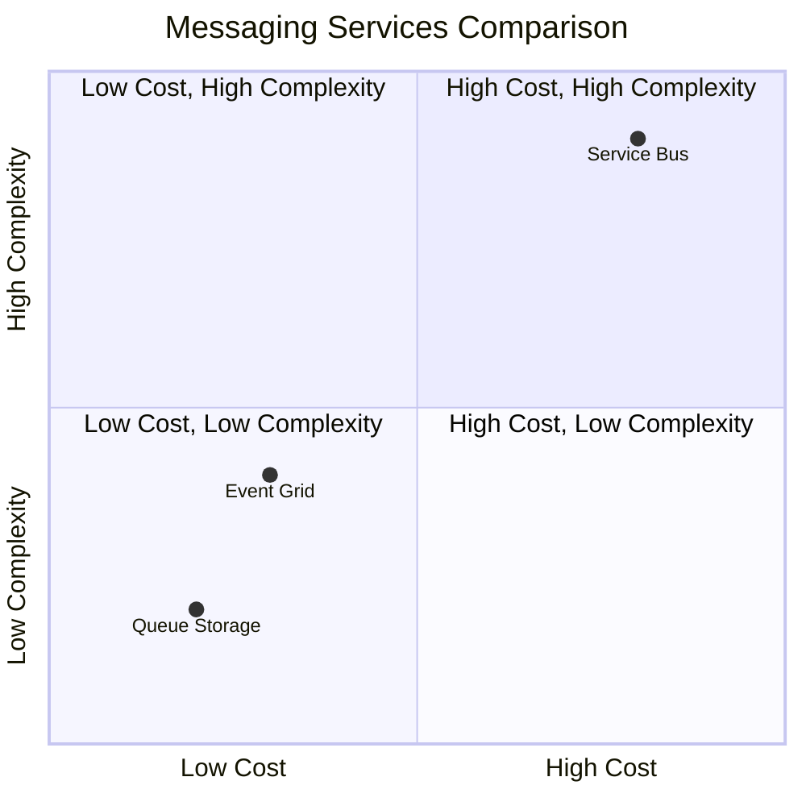
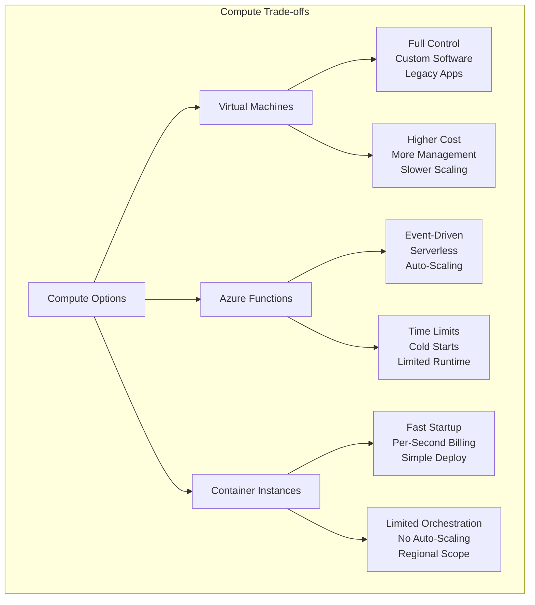
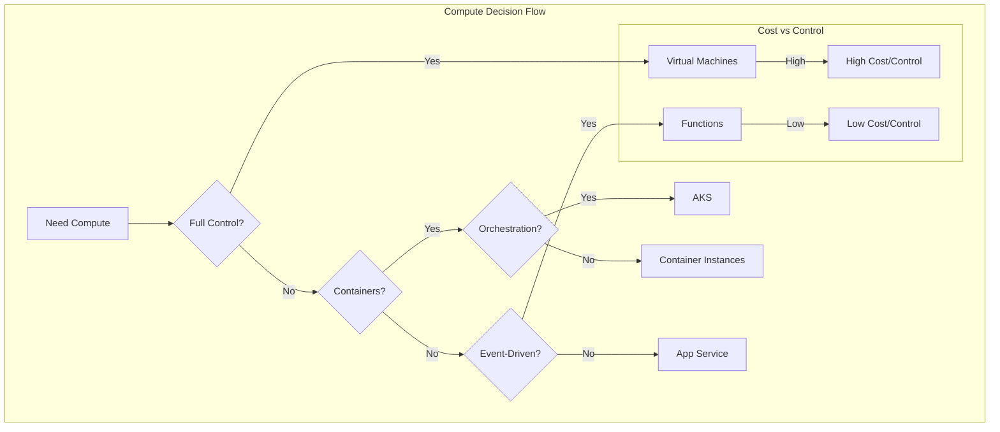
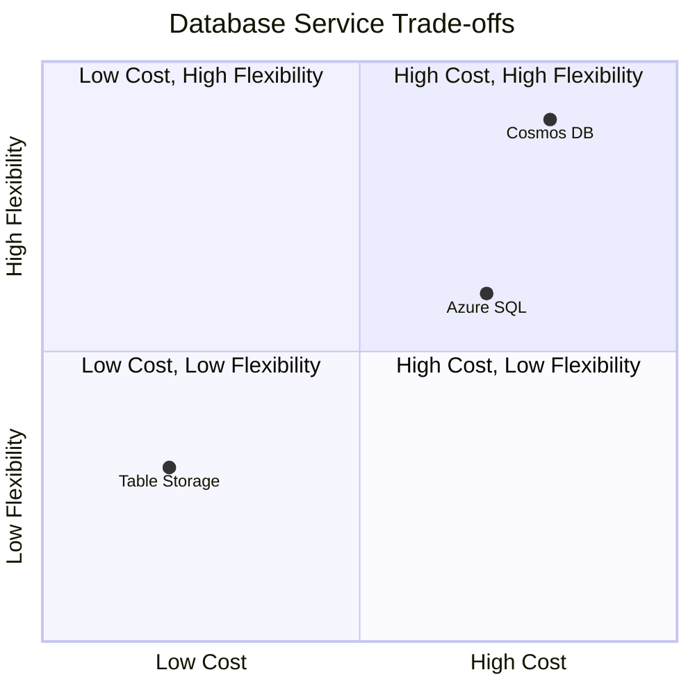
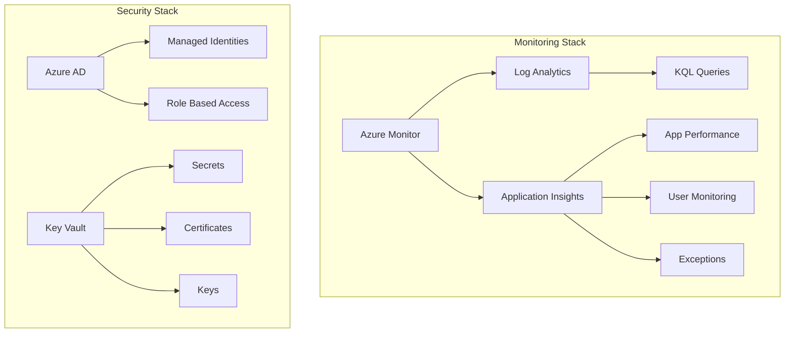

# Azure Service Trade-offs

This document outlines trade-offs between various Azure services.  It's a living document and subject to change as Azure evolves.  "Trade-off" means understanding that choosing one service means potentially sacrificing benefits offered by another. Consider your specific requirements (scale, cost, latency, reliability, complexity) to guide your decisions.

## 1. Messaging: Event Grid vs. Service Bus

- **Event Grid:**
  - **Use Cases:** Reactive architectures, event-driven microservices, IoT scenarios requiring high throughput and low latency. Ideal for delivering events to multiple subscribers.
  - **Trade-offs:** Limited message ordering guarantees. Best suited for asynchronous, fire-and-forget scenarios. No guaranteed delivery.

- **Service Bus:**
  - **Use Cases:** Reliable asynchronous messaging, guaranteed delivery, complex routing, transaction support. Suitable for critical business processes.
  - **Trade-offs:** Higher latency compared to Event Grid. More expensive than Event Grid.

## Messaging Service Comparison

## 2. Compute: Virtual Machines vs. Azure Functions vs. Azure Container Instances

- **Virtual Machines (VMs):**
  - **Use Cases:** Full control over the operating system and environment. Legacy applications, custom configurations.
  - **Trade-offs:** Higher cost and management overhead. Slower scaling compared to serverless options.

- **Azure Functions:**
  - **Use Cases:** Event-driven, serverless compute for lightweight tasks. Ideal for microservices and short-lived processes.
  - **Trade-offs:** Limited execution time. Not suitable for long-running processes.

- **Azure Container Instances (ACI):**
  - **Use Cases:** Running containers without managing VMs. Suitable for burst workloads and isolated tasks.
  - **Trade-offs:** Limited orchestration capabilities compared to Azure Kubernetes Service (AKS).

## Compute Service Selection

## 3. Storage: Blob Storage vs. Azure Files vs. Azure Disks

- **Blob Storage:**
  - **Use Cases:** Storing unstructured data like images, videos, and backups. Ideal for scalable, cost-effective storage.
  - **Trade-offs:** Not suitable for file-sharing scenarios.

- **Azure Files:**
  - **Use Cases:** Fully managed file shares accessible via SMB or NFS protocols. Suitable for lift-and-shift migrations.
  - **Trade-offs:** Higher cost compared to Blob Storage.

- **Azure Disks:**
  - **Use Cases:** Persistent storage for VMs. Suitable for high-performance workloads.
  - **Trade-offs:** Limited scalability compared to Blob Storage.

## 4. Databases: Azure SQL Database vs. Cosmos DB vs. Azure Table Storage

- **Azure SQL Database:**
  - **Use Cases:** Relational database with advanced querying capabilities. Suitable for OLTP and OLAP workloads.
  - **Trade-offs:** Higher cost for advanced features. Limited scalability compared to NoSQL options.

- **Cosmos DB:**
  - **Use Cases:** Globally distributed, multi-model database. Ideal for low-latency, high-availability applications.
  - **Trade-offs:** Higher complexity and cost compared to traditional databases.

- **Azure Table Storage:**
  - **Use Cases:** Key-value store for simple, scalable applications. Cost-effective for large datasets.
  - **Trade-offs:** Limited querying capabilities. Not suitable for complex data relationships.

## 5. Networking: Azure Front Door vs. Application Gateway vs. Traffic Manager

- **Azure Front Door:**
  - **Use Cases:** Global load balancing and content delivery. Ideal for web applications with global users.
  - **Trade-offs:** Limited Layer 7 routing features compared to Application Gateway.

- **Application Gateway:**
  - **Use Cases:** Layer 7 load balancing with advanced routing. Suitable for microservices and web applications.
  - **Trade-offs:** Regional scope. Higher cost compared to Traffic Manager.

- **Traffic Manager:**
  - **Use Cases:** DNS-based traffic routing. Ideal for multi-region failover and load balancing.
  - **Trade-offs:** Slower failover compared to Front Door.

## Monitoring & Security Architecture

## 6. Monitoring: Azure Monitor vs. Log Analytics vs. Application Insights

- **Azure Monitor:**
  - **Use Cases:** Centralized monitoring for Azure resources. Provides metrics and alerts.
  - **Trade-offs:** Limited deep-dive capabilities compared to Log Analytics.

- **Log Analytics:**
  - **Use Cases:** Querying and analyzing log data. Suitable for troubleshooting and diagnostics.
  - **Trade-offs:** Higher learning curve for KQL (Kusto Query Language).

- **Application Insights:**
  - **Use Cases:** Application performance monitoring. Ideal for developers to track application health.
  - **Trade-offs:** Limited scope to application-level monitoring.

## 7. Identity: Azure AD vs. Managed Identities vs. Key Vault

- **Azure AD:**
  - **Use Cases:** Identity and access management for users and applications. Suitable for enterprise-grade security.
  - **Trade-offs:** Requires integration effort for custom applications.

- **Managed Identities:**
  - **Use Cases:** Simplified identity management for Azure resources. Ideal for securing resource access.
  - **Trade-offs:** Limited to Azure resources.

- **Key Vault:**
  - **Use Cases:** Securely storing secrets, keys, and certificates. Suitable for compliance and security.
  - **Trade-offs:** Additional cost for premium features.

---

This document provides a high-level overview of Azure services and their trade-offs. For detailed guidance, refer to the official Azure documentation.